# Robot Teleoperation Simulator — System Design Document

**Version:** 1.0.0
**Author:** Naveen Hanuman
**Date:** March 2026
**Status:** Design Phase

---

## Table of Contents

1. [Executive Summary](#1-executive-summary)
2. [System Requirements](#2-system-requirements)
3. [Technology Stack](#3-technology-stack)
4. [Architecture Overview](#4-architecture-overview)
5. [Data-Driven Design (ECS Architecture)](#5-data-driven-design-ecs-architecture)
6. [SOLID Principles Application](#6-solid-principles-application)
7. [UML Diagrams](#7-uml-diagrams)
   - 7.1 [Use Case Diagram](#71-use-case-diagram)
   - 7.2 [Component Diagram](#72-component-diagram)
   - 7.3 [Backend Class Diagram](#73-backend-class-diagram)
   - 7.4 [Frontend Class Diagram](#74-frontend-class-diagram)
   - 7.5 [Sequence Diagrams](#75-sequence-diagrams)
   - 7.6 [State Machine Diagrams](#76-state-machine-diagrams)
   - 7.7 [Activity Diagram](#77-activity-diagram)
   - 7.8 [Deployment Diagram](#78-deployment-diagram)
   - 7.9 [Object Diagram](#79-object-diagram)
8. [Communication Protocol Design](#8-communication-protocol-design)
9. [Physics Engine Design](#9-physics-engine-design)
10. [Robot Kinematics Model](#10-robot-kinematics-model)
11. [Frontend Architecture](#11-frontend-architecture)
12. [Error Handling & Edge Cases](#12-error-handling--edge-cases)
13. [Logging Strategy](#13-logging-strategy)
14. [Testing Strategy](#14-testing-strategy)
15. [Performance & Scalability](#15-performance--scalability)
16. [Assumptions & Considerations](#16-assumptions--considerations)
17. [Setup & Running Instructions](#17-setup--running-instructions)
18. [Glossary](#18-glossary)

---

## 1. Executive Summary

This document describes the architecture and detailed design of a **real-time robot teleoperation simulator** that allows a remote operator to control a virtual robot through a web-based frontend, navigating a 2D environment populated with static and dynamic polygon obstacles.

The system is decomposed into two major modules:

- **Simulation Backend (C++20):** A high-performance server that maintains the authoritative world state using an Entity-Component-System (ECS) architecture, runs physics simulation with SAT-based collision detection, and broadcasts state updates over WebSocket at 30–60 Hz.
- **Web Frontend (TypeScript + React 18):** A browser client that renders the simulation scene on HTML5 Canvas, captures keyboard and gamepad inputs, and communicates with the backend over WebSocket using a binary (FlatBuffers) + JSON hybrid protocol.

The design follows **Data-Driven Design** principles (ECS over OOP inheritance hierarchies) and enforces **SOLID** principles at every interface boundary. The architecture is deliberately scoped for a single-operator, single-robot scenario while providing clean abstraction seams (`IMessageBus`, `IStateStore`) that allow future scaling to multi-operator / multi-robot configurations without modifying core simulation logic.

---

## 2. System Requirements

### 2.1 Functional Requirements

| ID | Requirement | Priority |
|----|-------------|----------|
| FR-01 | Operator controls a robot via keyboard (WASD/Arrow keys) | Must |
| FR-02 | Operator controls a robot via gamepad (analog sticks) | Must |
| FR-03 | Robot accepts remote commands to adjust velocity and steering angle | Must |
| FR-04 | Scene contains static (non-moving) polygon obstacles | Must |
| FR-05 | Scene contains dynamic (moving) polygon obstacles | Must |
| FR-06 | Robot and obstacles are rendered as polygons | Must |
| FR-07 | Simulation runs in real time | Must |
| FR-08 | Robot velocity drops to zero on collision with any obstacle | Must |
| FR-09 | Impact counter increments on each collision | Must |
| FR-10 | Robot cannot drive through obstacles | Must |
| FR-11 | Dynamic obstacles can pass through the robot | Should |
| FR-12 | Frontend visually displays robot, static obstacles, and dynamic obstacles | Must |
| FR-13 | System provides feedback at minimum 10 Hz (ideally faster) | Must |

### 2.2 Non-Functional Requirements

| ID | Requirement | Target |
|----|-------------|--------|
| NFR-01 | Support 20+ simultaneous static and dynamic objects | Must |
| NFR-02 | Scale to 100s–1000s of objects | Should |
| NFR-03 | Control feedback loop latency < 100ms (10 Hz) | Must |
| NFR-04 | State broadcast rate ≥ 30 Hz | Should |
| NFR-05 | Physics tick duration < 5ms at 1000 objects | Should |
| NFR-06 | Canvas render < 16ms per frame (60 FPS target) | Should |
| NFR-07 | System starts with a single `docker-compose up` | Must |
| NFR-08 | Structured event and debug logging at all layers | Must |
| NFR-09 | Comprehensive test coverage (unit, property, benchmark, integration, E2E) | Must |

### 2.3 Constraints

- Single operator, single robot (no multi-user concurrency in v1.0)
- 2D flat plane (no 3D, no terrain elevation)
- Convex polygons only (simplifies SAT collision detection)
- Static scene definition (no runtime obstacle spawning UI)
- WebSocket transport (no WebRTC, no UDP)
- 4-hour implementation window (skeleton, not production-complete)

---

## 3. Technology Stack

### 3.1 Backend

| Component | Technology | Version | Purpose |
|-----------|-----------|---------|---------|
| Language | C++20 | GCC 13+ / Clang 17+ | Core simulation, physics |
| ECS Framework | EnTT | 3.13+ | Data-driven entity management |
| WebSocket Server | uWebSockets | 20.x | High-performance WebSocket |
| Binary Serialization | FlatBuffers | 24.x | Zero-copy state broadcast |
| JSON | nlohmann/json | 3.11+ | Control commands, config |
| Logging | spdlog | 1.12+ | Structured async logging |
| Lock-free Queue | boost::lockfree::spsc_queue | 1.83+ | Command ingress buffer |
| Unit Testing | GoogleTest | 1.14+ | Unit + integration tests |
| Benchmarks | GoogleBenchmark | 1.8+ | Physics hot-path profiling |
| Property Testing | RapidCheck | master | Generative collision tests |
| Build System | CMake | 3.28+ | Build configuration |
| Package Manager | vcpkg | manifest mode | Dependency resolution |

### 3.2 Frontend

| Component | Technology | Version | Purpose |
|-----------|-----------|---------|---------|
| Language | TypeScript | 5.4+ | Type-safe client code |
| UI Framework | React 18 | 18.3+ | Component architecture |
| Rendering | HTML5 Canvas API | Native | 2D polygon rendering |
| Input | Gamepad API | Native | Joystick/controller support |
| State Management | Zustand | 4.5+ | Minimal reactive state |
| Build Tool | Vite | 5.x | Dev server + bundling |
| Unit Testing | Vitest | 1.x | Component + logic tests |
| Property Testing | fast-check | 3.x | Generative input tests |
| E2E Testing | Playwright | 1.42+ | Browser automation tests |
| Protocol | flatbuffers (npm) | 24.x | Binary deserialization |

### 3.3 Infrastructure

| Component | Technology | Purpose |
|-----------|-----------|---------|
| Containerization | Docker + Docker Compose | Single-command startup |
| Backend Image | Ubuntu 24.04 + GCC 13 | C++ build environment |
| Frontend Dev | Node 20 Alpine | Vite dev server |
| Reverse Proxy | Nginx (optional) | WebSocket upgrade, static files |

---

## 4. Architecture Overview

### 4.1 High-Level Architecture

The system follows a **client–server architecture** with clear separation of concerns:

```
┌─────────────────────────────────────────────────────────┐
│                    FRONTEND (Browser)                    │
│                                                         │
│  ┌──────────┐  ┌──────────┐  ┌──────────┐  ┌────────┐ │
│  │  Canvas   │  │  Input   │  │  HUD     │  │ Conn.  │ │
│  │ Renderer  │  │ Handler  │  │ Overlay  │  │ Mgr    │ │
│  └────┬─────┘  └────┬─────┘  └────┬─────┘  └───┬────┘ │
│       │              │              │             │      │
│       └──────────────┴──────┬───────┴─────────────┘      │
│                             │                            │
│                      ┌──────┴──────┐                     │
│                      │   Zustand   │                     │
│                      │    Store    │                     │
│                      └──────┬──────┘                     │
└─────────────────────────────┼────────────────────────────┘
                              │ WebSocket
                              │ (FlatBuffers ↓ / JSON ↑)
┌─────────────────────────────┼────────────────────────────┐
│                    BACKEND (C++20)                        │
│                             │                            │
│                      ┌──────┴──────┐                     │
│                      │  WebSocket  │                     │
│                      │   Gateway   │                     │
│                      └──────┬──────┘                     │
│                             │                            │
│  ┌──────────────────────────┴───────────────────────┐    │
│  │              Simulation Engine                    │    │
│  │                                                   │    │
│  │  ┌───────────┐ ┌───────────┐ ┌────────────────┐ │    │
│  │  │  Physics   │ │ Kinematics│ │   Collision    │ │    │
│  │  │  System    │ │  System   │ │    System      │ │    │
│  │  └───────────┘ └───────────┘ └────────────────┘ │    │
│  │                                                   │    │
│  │  ┌───────────┐ ┌───────────┐ ┌────────────────┐ │    │
│  │  │  Movement  │ │  Scoring  │ │  Broadcast     │ │    │
│  │  │  System    │ │  System   │ │  System        │ │    │
│  │  └───────────┘ └───────────┘ └────────────────┘ │    │
│  │                                                   │    │
│  │           ┌──────────────────────┐               │    │
│  │           │   EnTT ECS Registry  │               │    │
│  │           │  (Authoritative State)│               │    │
│  │           └──────────────────────┘               │    │
│  └──────────────────────────────────────────────────┘    │
│                                                          │
│  ┌──────────┐  ┌──────────┐  ┌──────────────────────┐   │
│  │  spdlog  │  │  Config  │  │  IMessageBus         │   │
│  │  Logger  │  │  Loader  │  │  (InProcessBus)      │   │
│  └──────────┘  └──────────┘  └──────────────────────┘   │
└──────────────────────────────────────────────────────────┘
```

### 4.2 Thread Model

The backend runs two threads with lock-free communication:

```
Thread 1: Simulation Loop (Real-Time)
  ├── Read commands from SPSC queue (lock-free)
  ├── Apply Ackermann kinematics to robot
  ├── Move dynamic obstacles along waypoints
  ├── Broad-phase collision (spatial hash grid)
  ├── Narrow-phase collision (SAT)
  ├── Resolve collisions (zero velocity, increment counter)
  ├── Serialize world state (FlatBuffers)
  └── Enqueue state buffer for broadcast

Thread 2: Network I/O (Event Loop)
  ├── Accept WebSocket connections
  ├── Receive JSON command messages
  ├── Enqueue commands into SPSC queue
  ├── Dequeue state buffers
  └── Broadcast FlatBuffers frames to connected clients
```

**Why two threads instead of one?**
The simulation tick must be deterministic and run at a fixed timestep (e.g., 60 Hz physics). Network I/O is inherently asynchronous and bursty. Separating them ensures a slow client or network hiccup never delays the physics tick. The SPSC (single-producer, single-consumer) queue provides zero-allocation, lock-free communication between the two threads.

---

## 5. Data-Driven Design (ECS Architecture)

### 5.1 Why ECS Over Traditional OOP

Traditional OOP would model this as:

```
class GameObject { virtual void update(); }
class Robot : public GameObject { ... }
class StaticObstacle : public GameObject { ... }
class DynamicObstacle : public GameObject { ... }
```

This creates problems at scale:
- **Cache misses:** Virtual dispatch scatters data across heap allocations
- **Rigid hierarchy:** Adding "a robot that is also an obstacle" requires multiple inheritance
- **Violation of OCP:** Adding a new component (e.g., health bar) requires modifying base classes

**ECS inverts this** — entities are IDs, components are plain data structs, systems are functions that iterate over component views. This gives us:

- **Cache-friendly iteration:** All `Transform` components are contiguous in memory
- **Composition over inheritance:** An entity becomes a "dynamic obstacle" by attaching `{Transform, Polygon, Velocity, WaypointPath}` — no class hierarchy needed
- **Open-Closed Principle:** New systems can be added without modifying existing ones

### 5.2 Component Definitions

```cpp
// ── Transform ───────────────────────────────────────────
struct Transform {
    float x = 0.0f;          // World position X (meters)
    float y = 0.0f;          // World position Y (meters)
    float heading = 0.0f;    // Rotation in radians (0 = East, CCW positive)
};

// ── Polygon Shape ───────────────────────────────────────
struct PolygonShape {
    std::vector<Vec2> localVertices;   // Vertices in local space (CCW winding)
    std::vector<Vec2> worldVertices;   // Cached world-space vertices (recomputed each tick)
    AABB aabb;                         // Axis-aligned bounding box (recomputed each tick)
};

// ── Velocity ────────────────────────────────────────────
struct Velocity {
    float speed = 0.0f;          // Linear speed (m/s), positive = forward
    float angularVelocity = 0.0f; // Rotational velocity (rad/s)
};

// ── Robot Tag ───────────────────────────────────────────
struct RobotTag {
    float steeringAngle = 0.0f;  // Current steering angle (radians)
    float wheelbase = 2.0f;       // Distance between axles (meters)
    float maxSpeed = 5.0f;        // Maximum forward speed (m/s)
    float maxSteeringAngle = 0.6f;// Maximum steering angle (radians, ~34°)
};

// ── Static Obstacle Tag ─────────────────────────────────
struct StaticTag {};  // Marker component — no data needed

// ── Dynamic Obstacle ────────────────────────────────────
struct WaypointPath {
    std::vector<Vec2> waypoints;     // Ordered path waypoints
    size_t currentIndex = 0;          // Current target waypoint
    float speed = 1.5f;              // Movement speed (m/s)
    bool loop = true;                 // Loop back to start?
};

// ── Collision State ─────────────────────────────────────
struct CollisionState {
    bool isColliding = false;         // Currently in collision?
    entt::entity collidedWith = entt::null;  // Last collision partner
};

// ── Scoring (Singleton Component) ───────────────────────
struct ScoreState {
    uint32_t impactCount = 0;         // Total collision events
    uint64_t sessionStartMs = 0;      // Session start timestamp
};

// ── Network Session (Singleton Component) ────────────────
struct SessionState {
    bool operatorConnected = false;
    uint64_t lastCommandTimestamp = 0;
    uint32_t commandSequence = 0;
    uint32_t stateSequence = 0;
};

// ── Render Metadata ─────────────────────────────────────
struct RenderMeta {
    uint32_t color = 0xFF0000FF;      // RGBA color for rendering
    uint8_t layer = 0;                // Render layer (0=ground, 1=obstacles, 2=robot)
};
```

### 5.3 Entity Archetypes

| Archetype | Components |
|-----------|-----------|
| Robot | `Transform`, `PolygonShape`, `Velocity`, `RobotTag`, `CollisionState`, `RenderMeta` |
| Static Obstacle | `Transform`, `PolygonShape`, `StaticTag`, `RenderMeta` |
| Dynamic Obstacle | `Transform`, `PolygonShape`, `Velocity`, `WaypointPath`, `RenderMeta` |
| World State (Singleton) | `ScoreState`, `SessionState` |

### 5.4 System Execution Order

Systems execute in a fixed, deterministic order each tick:

```
1. InputSystem         — Dequeue commands from SPSC queue, update RobotTag
2. KinematicsSystem    — Apply Ackermann model to robot, update Velocity/Transform
3. MovementSystem      — Move dynamic obstacles along waypoints, update Transform
4. TransformSystem     — Recompute world vertices and AABBs from Transform + PolygonShape
5. CollisionSystem     — Broad-phase (spatial hash) → Narrow-phase (SAT) → Resolve
6. ScoringSystem       — Check CollisionState, increment impact counter, zero robot velocity
7. BroadcastSystem     — Serialize world state to FlatBuffers, enqueue for network thread
8. LoggingSystem       — Flush event log buffer (collisions, connections, tick timing)
```

Each system is a free function that operates on an `entt::view` — no inheritance, no virtual dispatch, no shared mutable state between systems (all communication happens through component mutation within the same tick).

---

## 6. SOLID Principles Application

### 6.1 Single Responsibility Principle (SRP)

Every class, system, and component has exactly one reason to change:

| Element | Single Responsibility | What It Does NOT Do |
|---------|----------------------|---------------------|
| `CollisionSystem` | Detect polygon intersections | Does NOT resolve collisions (that's `ScoringSystem`) |
| `KinematicsSystem` | Compute robot pose from steering input | Does NOT read network input (that's `InputSystem`) |
| `WebSocketGateway` | Manage WebSocket connections and I/O | Does NOT parse commands (that's `CommandParser`) |
| `CanvasRenderer` | Draw polygons to canvas | Does NOT manage state (that's `Zustand store`) |
| `InputHandler` | Capture keyboard/gamepad events | Does NOT send WebSocket messages (that's `ConnectionManager`) |
| `Transform` component | Store position and heading | Does NOT store shape data (that's `PolygonShape`) |

### 6.2 Open-Closed Principle (OCP)

The system is open for extension and closed for modification:

- **Adding a new entity type** (e.g., a moving platform): Create a new archetype by composing existing components + a new tag component. No existing system code changes.
- **Adding a new system** (e.g., `ParticleSystem` for collision effects): Register a new system function in the tick pipeline. Existing systems remain untouched.
- **Adding a new input source** (e.g., a REST API for scripted commands): Implement the `ICommandSource` interface. The `InputSystem` consumes commands through the interface without knowing the source.

### 6.3 Liskov Substitution Principle (LSP)

All interface implementations are fully substitutable:

```cpp
// Any IMessageBus implementation can be swapped without breaking consumers
class IMessageBus {
public:
    virtual ~IMessageBus() = default;
    virtual void publish(Topic topic, std::span<const uint8_t> data) = 0;
    virtual void subscribe(Topic topic, MessageCallback callback) = 0;
};

class InProcessBus : public IMessageBus { /* lock-free ring buffer */ };
class KafkaBus : public IMessageBus { /* future: Kafka producer/consumer */ };
// Both satisfy the same contract — consumers never know the difference
```

### 6.4 Interface Segregation Principle (ISP)

Clients depend only on the interfaces they use:

```cpp
// The renderer only needs read access to position and shape
class IWorldView {
public:
    virtual std::vector<EntitySnapshot> getEntitySnapshots() const = 0;
    virtual ScoreState getScore() const = 0;
};

// The physics system needs mutable access to transforms and collision state
class IPhysicsWorld {
public:
    virtual entt::view<Transform, PolygonShape, Velocity> getMoveableEntities() = 0;
    virtual entt::view<Transform, PolygonShape> getAllCollidables() = 0;
};

// The input system only needs to mutate robot commands
class IRobotControl {
public:
    virtual void setThrottle(float throttle) = 0;
    virtual void setSteering(float angle) = 0;
};
```

### 6.5 Dependency Inversion Principle (DIP)

High-level modules depend on abstractions, not concrete implementations:

```cpp
// High-level: SimulationEngine depends on abstractions
class SimulationEngine {
    std::unique_ptr<IMessageBus> messageBus_;
    std::unique_ptr<IStateStore> stateStore_;
    std::unique_ptr<ILogger> logger_;
public:
    SimulationEngine(
        std::unique_ptr<IMessageBus> bus,
        std::unique_ptr<IStateStore> store,
        std::unique_ptr<ILogger> logger
    );
};

// Low-level: Concrete implementations injected at composition root
auto engine = SimulationEngine(
    std::make_unique<InProcessBus>(),
    std::make_unique<ECSStateStore>(registry),
    std::make_unique<SpdlogLogger>("sim-engine")
);
```

**Composition Root** (the only place concrete types are mentioned):

```cpp
// main.cpp — the ONLY file that knows about concrete implementations
int main() {
    auto config = ConfigLoader::fromFile("config.json");
    auto registry = entt::registry{};
    auto bus = std::make_unique<InProcessBus>(config.busCapacity);
    auto store = std::make_unique<ECSStateStore>(registry);
    auto logger = std::make_unique<SpdlogLogger>("teleop", config.logLevel);
    auto gateway = std::make_unique<WebSocketGateway>(config.port, *bus, *logger);
    auto engine = SimulationEngine(std::move(bus), std::move(store), std::move(logger));
    
    SceneLoader::loadScene(registry, config.scenePath);
    engine.run();  // Blocks until shutdown signal
}
```

---

## 7. UML Diagrams

### 7.1 Use Case Diagram

```mermaid
@startuml
left to right direction

actor "Operator" as op
actor "System Clock" as clock
actor "Dynamic Obstacle\nAI" as ai

rectangle "Robot Teleoperation System" {
    usecase "Connect to Simulator" as UC1
    usecase "Control Robot via Keyboard" as UC2
    usecase "Control Robot via Gamepad" as UC3
    usecase "View Simulation Scene" as UC4
    usecase "Monitor Impact Counter" as UC5
    usecase "Run Physics Simulation" as UC6
    usecase "Detect Collisions" as UC7
    usecase "Move Dynamic Obstacles" as UC8
    usecase "Broadcast World State" as UC9
    usecase "Log Events" as UC10
    usecase "Disconnect / Reconnect" as UC11
}

op --> UC1
op --> UC2
op --> UC3
op --> UC4
op --> UC5
op --> UC11

clock --> UC6
clock --> UC9

ai --> UC8

UC6 ..> UC7 : <<include>>
UC7 ..> UC10 : <<include>>
UC2 ..> UC6 : <<triggers>>
UC3 ..> UC6 : <<triggers>>
UC6 ..> UC9 : <<include>>
@enduml
```

**Use Case Descriptions:**

| UC | Name | Actor | Description | Precondition | Postcondition |
|----|------|-------|-------------|--------------|---------------|
| UC1 | Connect to Simulator | Operator | Establish WebSocket connection to backend | Backend running | Session active, initial state received |
| UC2 | Control Robot via Keyboard | Operator | WASD/Arrow keys send velocity/steering commands | Connected | Robot pose updated in next tick |
| UC3 | Control Robot via Gamepad | Operator | Analog stick axes mapped to velocity/steering | Connected, gamepad detected | Robot pose updated in next tick |
| UC4 | View Simulation Scene | Operator | Canvas renders all entities in real-time | Connected, state streaming | Visual representation at 30+ FPS |
| UC5 | Monitor Impact Counter | Operator | HUD displays cumulative collision count | Connected | Counter always matches server state |
| UC6 | Run Physics Simulation | System Clock | Fixed-timestep simulation tick at 60 Hz | Scene loaded | World state advanced by dt |
| UC7 | Detect Collisions | System Clock | SAT check between robot and all obstacles | Entities have world vertices | CollisionState updated |
| UC8 | Move Dynamic Obstacles | Obstacle AI | Waypoint-following movement each tick | Waypoints defined | Dynamic obstacle positions updated |
| UC9 | Broadcast World State | System Clock | Serialize and send state to all connected clients | Clients connected | Clients receive state update |
| UC10 | Log Events | System | Record collisions, connections, errors | Logger initialized | Log entries written |
| UC11 | Disconnect / Reconnect | Operator | Handle network interruptions gracefully | Was connected | Auto-reconnect or clean disconnect |

### 7.2 Component Diagram

```mermaid
@startuml
package "Frontend (Browser)" {
    [CanvasRenderer] as CR
    [InputHandler] as IH
    [HUDOverlay] as HUD
    [ConnectionManager] as CM
    [GameStateStore] as GSS

    CR --> GSS : reads state
    IH --> GSS : writes input
    HUD --> GSS : reads score
    CM --> GSS : writes server state
    IH --> CM : sends commands
}

package "Network Layer" {
    [WebSocket Channel] as WS
    [FlatBuffers Codec] as FB
    [JSON Codec] as JC
}

package "Backend (C++20 Server)" {
    package "Gateway Layer" {
        [WebSocketGateway] as GW
        [CommandParser] as CP
        [StateSerializer] as SS
    }

    package "Simulation Engine" {
        [InputSystem] as IS
        [KinematicsSystem] as KS
        [MovementSystem] as MS
        [TransformSystem] as TS
        [CollisionSystem] as CS
        [ScoringSystem] as ScS
        [BroadcastSystem] as BS
        [LoggingSystem] as LS
    }

    package "Core Infrastructure" {
        [EnTT Registry] as REG
        [InProcessBus] as BUS
        [SpdlogLogger] as LOG
        [ConfigLoader] as CFG
        [SceneLoader] as SL
    }

    package "Physics Library" {
        [SpatialHashGrid] as SHG
        [SATDetector] as SAT
        [AckermannModel] as ACK
    }
}

CM --> WS : send/receive
WS --> GW : frames
GW --> CP : raw bytes
CP --> IS : CommandMessage
BS --> SS : EntityData
SS --> GW : FlatBuffer bytes
GW --> WS : broadcast

IS --> REG : update RobotTag
KS --> REG : update Transform
MS --> REG : update Transform
TS --> REG : update PolygonShape
CS --> REG : update CollisionState
CS --> SHG : broad phase
CS --> SAT : narrow phase
KS --> ACK : steering math
ScS --> REG : update ScoreState
BS --> REG : read all
LS --> LOG : write events
SL --> REG : create entities
@enduml
```

### 7.3 Backend Class Diagram

```mermaid
classDiagram
    direction TB

    %% ── Interfaces ─────────────────────────────────
    class IMessageBus {
        <<interface>>
        +publish(Topic, span~uint8_t~) void
        +subscribe(Topic, MessageCallback) void
    }

    class IStateStore {
        <<interface>>
        +getEntitySnapshots() vector~EntitySnapshot~
        +getScoreState() ScoreState
    }

    class ICommandSource {
        <<interface>>
        +tryDequeue(CommandMessage&) bool
    }

    class ICollisionDetector {
        <<interface>>
        +detect(span~Polygon~) vector~CollisionPair~
    }

    class ILogger {
        <<interface>>
        +info(string_view, Args...) void
        +warn(string_view, Args...) void
        +error(string_view, Args...) void
        +debug(string_view, Args...) void
        +trace(string_view, Args...) void
    }

    class IRobotKinematics {
        <<interface>>
        +computeStep(RobotState, float dt) RobotState
    }

    %% ── Concrete Implementations ───────────────────
    class InProcessBus {
        -spsc_queue~Message~ queue_
        -subscribers_ : map~Topic,vector~Callback~~
        +publish(Topic, span~uint8_t~) void
        +subscribe(Topic, MessageCallback) void
    }

    class ECSStateStore {
        -registry_ : entt::registry&
        +getEntitySnapshots() vector~EntitySnapshot~
        +getScoreState() ScoreState
    }

    class SPSCCommandSource {
        -queue_ : spsc_queue~CommandMessage~
        +enqueue(CommandMessage) bool
        +tryDequeue(CommandMessage&) bool
    }

    class SATCollisionDetector {
        -grid_ : SpatialHashGrid
        +detect(span~Polygon~) vector~CollisionPair~
        -testSAT(Polygon&, Polygon&) bool
        -getAxes(Polygon&) vector~Vec2~
        -project(Polygon&, Vec2) Projection
    }

    class SpdlogLogger {
        -logger_ : shared_ptr~spdlog::logger~
        +info(string_view, Args...) void
        +warn(string_view, Args...) void
        +error(string_view, Args...) void
    }

    class AckermannModel {
        -wheelbase_ : float
        -maxSteeringAngle_ : float
        -maxSpeed_ : float
        +computeStep(RobotState, float dt) RobotState
        +clampSteering(float angle) float
        +turningRadius(float steeringAngle) float
    }

    %% ── Core Engine ────────────────────────────────
    class SimulationEngine {
        -registry_ : entt::registry
        -messageBus_ : unique_ptr~IMessageBus~
        -stateStore_ : unique_ptr~IStateStore~
        -logger_ : unique_ptr~ILogger~
        -tickRate_ : float
        -running_ : atomic~bool~
        +run() void
        +stop() void
        -tick(float dt) void
    }

    class WebSocketGateway {
        -app_ : uWS::App
        -commandSource_ : SPSCCommandSource&
        -logger_ : ILogger&
        -clients_ : vector~WebSocket*~
        +start(uint16_t port) void
        +broadcast(span~uint8_t~ data) void
        -onOpen(WebSocket*) void
        -onMessage(WebSocket*, string_view) void
        -onClose(WebSocket*) void
    }

    %% ── Physics Support ────────────────────────────
    class SpatialHashGrid {
        -cellSize_ : float
        -cells_ : unordered_map~CellKey, vector~EntityId~~
        +clear() void
        +insert(EntityId, AABB) void
        +query(AABB) vector~EntityId~
        +getCandidatePairs() vector~pair~EntityId,EntityId~~
    }

    class SceneLoader {
        +loadScene(registry&, string path)$ void
        +createRobot(registry&, Transform, PolygonDef)$ Entity
        +createStaticObstacle(registry&, Transform, PolygonDef)$ Entity
        +createDynamicObstacle(registry&, Transform, PolygonDef, WaypointDef)$ Entity
    }

    class ConfigLoader {
        +fromFile(string path)$ Config
        +fromEnv()$ Config
        +validate(Config)$ bool
    }

    %% ── Data Types ─────────────────────────────────
    class Vec2 {
        +x : float
        +y : float
        +dot(Vec2) float
        +cross(Vec2) float
        +normalized() Vec2
        +perpendicular() Vec2
        +length() float
        +operator+(Vec2) Vec2
        +operator-(Vec2) Vec2
        +operator*(float) Vec2
    }

    class AABB {
        +min : Vec2
        +max : Vec2
        +overlaps(AABB) bool
        +expand(Vec2) AABB
        +center() Vec2
        +halfExtents() Vec2
    }

    class CommandMessage {
        +type : CommandType
        +throttle : float
        +steering : float
        +sequence : uint32_t
        +timestamp : uint64_t
    }

    class EntitySnapshot {
        +entityId : uint32_t
        +entityType : EntityType
        +x : float
        +y : float
        +heading : float
        +vertices : vector~Vec2~
        +color : uint32_t
    }

    class CollisionPair {
        +entityA : EntityId
        +entityB : EntityId
        +normal : Vec2
        +penetrationDepth : float
    }

    %% ── Relationships ──────────────────────────────
    IMessageBus <|.. InProcessBus
    IStateStore <|.. ECSStateStore
    ICommandSource <|.. SPSCCommandSource
    ICollisionDetector <|.. SATCollisionDetector
    ILogger <|.. SpdlogLogger
    IRobotKinematics <|.. AckermannModel

    SimulationEngine --> IMessageBus : uses
    SimulationEngine --> IStateStore : uses
    SimulationEngine --> ILogger : uses
    SimulationEngine --> ICollisionDetector : uses
    SimulationEngine --> IRobotKinematics : uses

    WebSocketGateway --> SPSCCommandSource : enqueues to
    WebSocketGateway --> ILogger : logs to

    SATCollisionDetector --> SpatialHashGrid : uses for broad phase
    SATCollisionDetector --> Vec2 : operates on
    SATCollisionDetector --> AABB : uses for bounds

    SimulationEngine ..> SceneLoader : initializes with
    SimulationEngine ..> ConfigLoader : configured by
```

### 7.4 Frontend Class Diagram

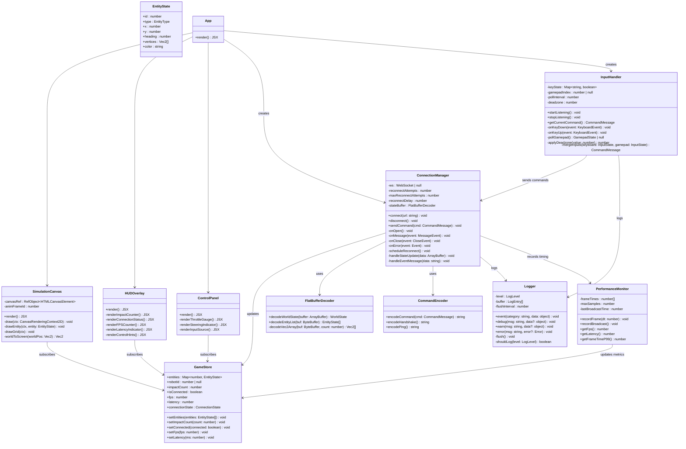

### 7.5 Sequence Diagrams

#### 7.5.1 Connection Handshake

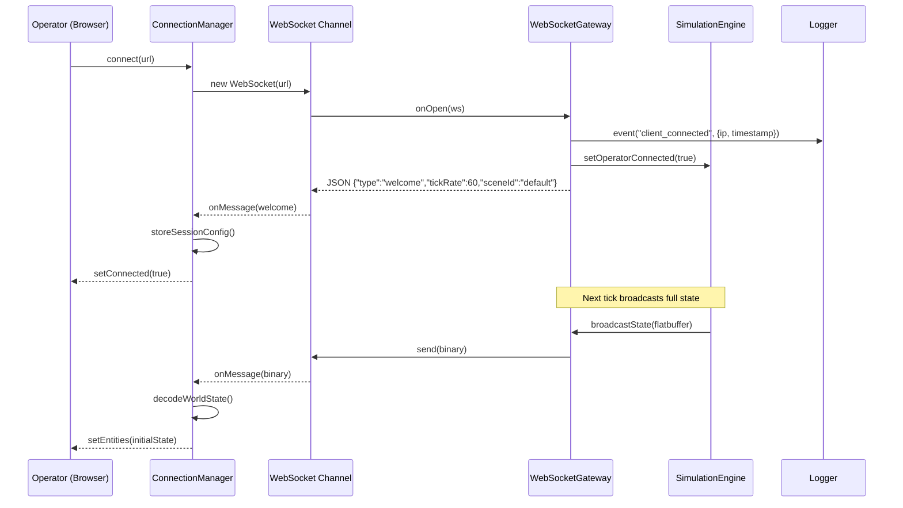

#### 7.5.2 Control Loop (Normal Operation)

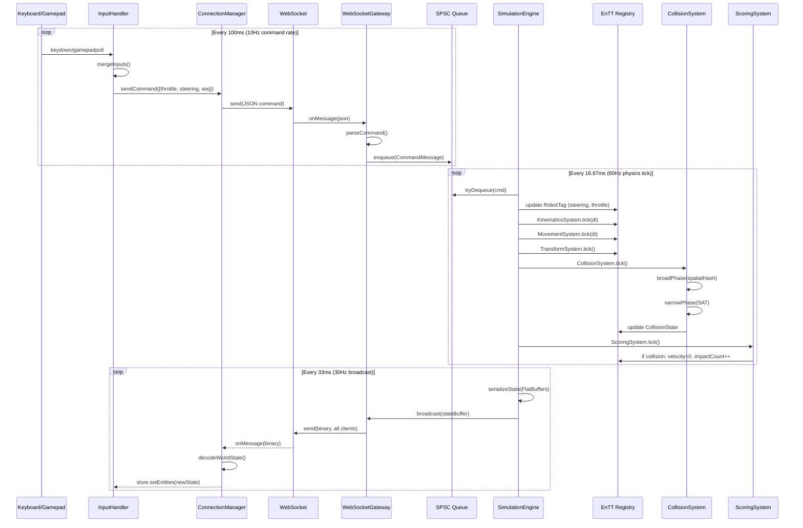

#### 7.5.3 Collision Event

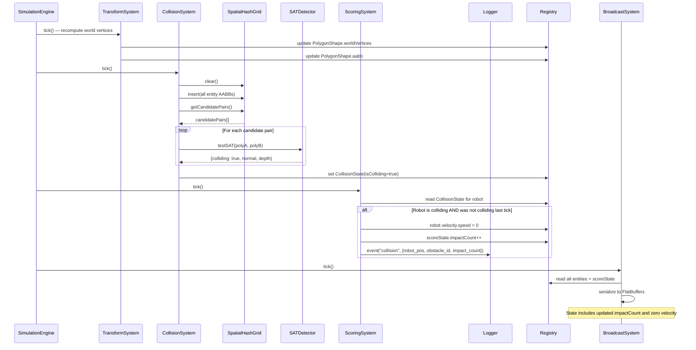

#### 7.5.4 Disconnection and Reconnection

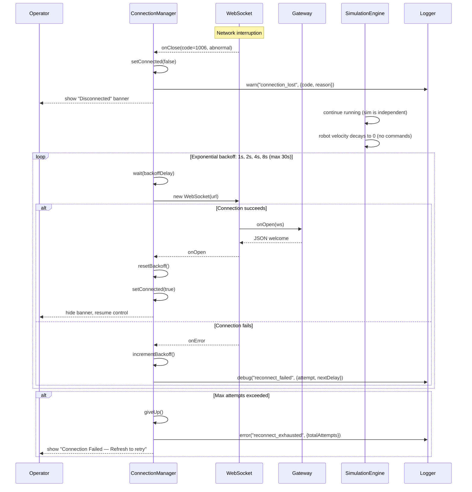

### 7.6 State Machine Diagrams

#### 7.6.1 Connection State Machine (Frontend)

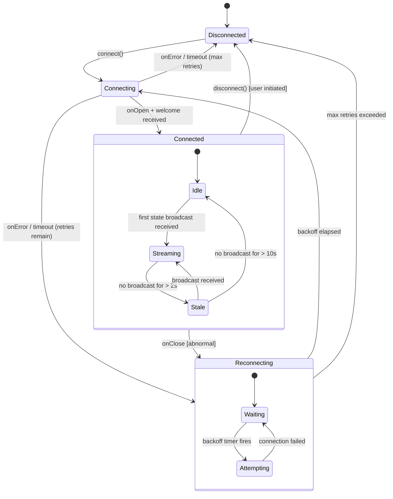

**State Descriptions:**

| State | Description | UI Indicator |
|-------|-------------|-------------|
| Disconnected | No WebSocket connection | Red dot, "Disconnected" |
| Connecting | WebSocket handshake in progress | Yellow dot, "Connecting..." |
| Connected.Idle | Connected but no state data yet | Yellow dot, "Waiting for data..." |
| Connected.Streaming | Normal operation, data flowing | Green dot, "Connected" |
| Connected.Stale | Connected but no data for >2s | Orange dot, "Data stale" |
| Reconnecting.Waiting | Waiting for backoff timer | Yellow dot, "Reconnecting in Xs..." |
| Reconnecting.Attempting | Trying to establish connection | Yellow dot, "Reconnecting..." |

#### 7.6.2 Robot State Machine (Backend)

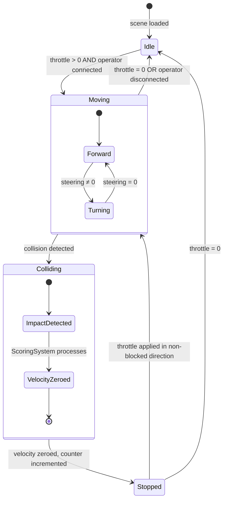

#### 7.6.3 Simulation Engine State Machine

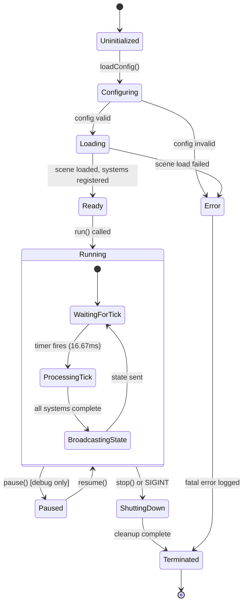

### 7.7 Activity Diagram

#### 7.7.1 Physics Tick Activity

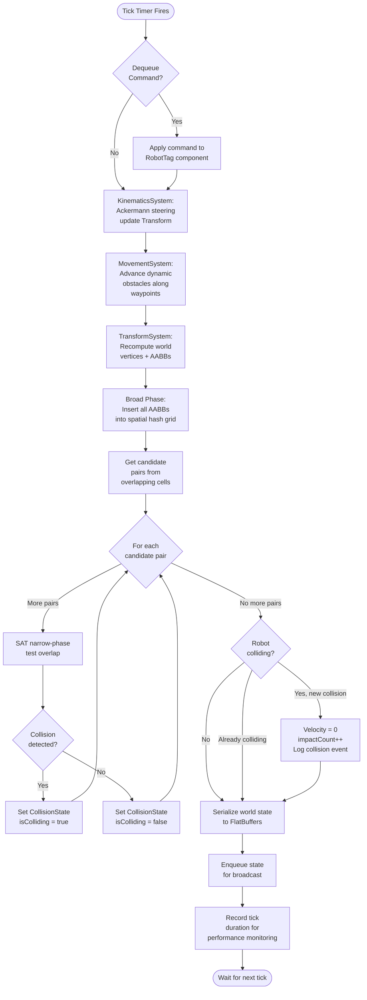

### 7.8 Deployment Diagram

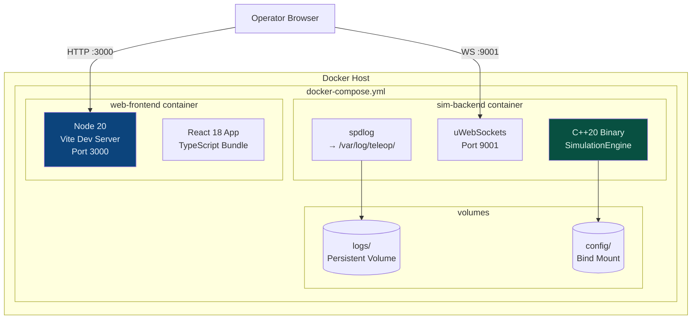

**Container Specifications:**

| Container | Base Image | Exposed Ports | Resources |
|-----------|-----------|---------------|-----------|
| `sim-backend` | Ubuntu 24.04 + GCC 13 (multi-stage) | 9001 (WebSocket) | 1 CPU, 512MB RAM |
| `web-frontend` | Node 20 Alpine | 3000 (HTTP + HMR) | 0.5 CPU, 256MB RAM |

**Volume Mounts:**

| Volume | Container Path | Host Path | Purpose |
|--------|---------------|-----------|---------|
| `logs` | `/var/log/teleop/` | `./logs/` | Persistent log storage |
| `config` | `/app/config/` | `./config/` | Scene definitions, config.json |

### 7.9 Object Diagram (Runtime Snapshot)

```mermaid
classDiagram
    direction LR

    class `robot:Entity#0` {
        Transform: {x:5.0, y:3.0, heading:0.785}
        PolygonShape: {vertices:[4 points], aabb:{...}}
        Velocity: {speed:2.5, angularVelocity:0.1}
        RobotTag: {steering:0.3, wheelbase:2.0}
        CollisionState: {isColliding:false}
        RenderMeta: {color:0x00FF00FF, layer:2}
    }

    class `wall_1:Entity#1` {
        Transform: {x:10.0, y:0.0, heading:0.0}
        PolygonShape: {vertices:[4 points], aabb:{...}}
        StaticTag: {}
        RenderMeta: {color:0x888888FF, layer:1}
    }

    class `patrol_bot:Entity#5` {
        Transform: {x:8.0, y:6.0, heading:1.57}
        PolygonShape: {vertices:[3 points], aabb:{...}}
        Velocity: {speed:1.5, angularVelocity:0.0}
        WaypointPath: {waypoints:[5 pts], idx:2, speed:1.5}
        RenderMeta: {color:0xFF4444FF, layer:1}
    }

    class `world:Singleton` {
        ScoreState: {impactCount:3, sessionStartMs:17...}
        SessionState: {connected:true, cmdSeq:142, stateSeq:8547}
    }
```

---

## 8. Communication Protocol Design

### 8.1 Protocol Overview

The system uses a **hybrid binary/JSON protocol** over a single WebSocket connection:

| Direction | Format | Content | Frequency |
|-----------|--------|---------|-----------|
| Server → Client | FlatBuffers (binary) | World state (all entities) | 30–60 Hz |
| Client → Server | JSON (text) | Commands, handshake, ping | 10 Hz |
| Server → Client | JSON (text) | Welcome, events, errors | On event |

### 8.2 FlatBuffers Schema (IDL)

```flatbuffers
// teleop.fbs — shared schema (generates C++ and TypeScript)

namespace Teleop;

struct Vec2 {
    x: float;
    y: float;
}

enum EntityType : byte {
    Robot = 0,
    StaticObstacle = 1,
    DynamicObstacle = 2
}

table Entity {
    id: uint32;
    entity_type: EntityType;
    x: float;
    y: float;
    heading: float;
    vertices: [Vec2];
    color: uint32;
}

table WorldState {
    sequence: uint32;
    timestamp_ms: uint64;
    tick_number: uint64;
    entities: [Entity];
    impact_count: uint32;
    robot_speed: float;
    robot_steering: float;
}

root_type WorldState;
```

**Generated artifacts:**
- `teleop_generated.h` (C++ header, zero-copy access)
- `teleop_generated.ts` (TypeScript module, decoding + type definitions)

### 8.3 JSON Command Schema

```json
// Client → Server: Control command
{
    "type": "command",
    "throttle": 0.75,           // -1.0 (full reverse) to 1.0 (full forward)
    "steering": -0.3,           // -1.0 (full left) to 1.0 (full right)
    "sequence": 142,            // Monotonically increasing per session
    "timestamp": 1711036800000  // Client-side Unix ms timestamp
}

// Client → Server: Handshake
{
    "type": "handshake",
    "clientVersion": "1.0.0",
    "protocolVersion": 1
}

// Client → Server: Ping (latency measurement)
{
    "type": "ping",
    "timestamp": 1711036800000
}

// Server → Client: Welcome
{
    "type": "welcome",
    "tickRate": 60,
    "broadcastRate": 30,
    "sceneId": "default",
    "protocolVersion": 1,
    "serverVersion": "1.0.0"
}

// Server → Client: Pong
{
    "type": "pong",
    "clientTimestamp": 1711036800000,
    "serverTimestamp": 1711036800123
}

// Server → Client: Event
{
    "type": "event",
    "event": "collision",
    "data": {
        "impactCount": 4,
        "robotPosition": {"x": 5.0, "y": 3.0},
        "obstacleId": 7
    }
}

// Server → Client: Error
{
    "type": "error",
    "code": "INVALID_COMMAND",
    "message": "Throttle value out of range: 1.5"
}
```

### 8.4 Protocol State Machine

```
Client                              Server
  |                                    |
  |--- WebSocket Connect ------------->|
  |<-- WebSocket Accept ---------------|
  |                                    |
  |--- {"type":"handshake"} ---------->|
  |<-- {"type":"welcome"} -------------|
  |                                    |
  |--- {"type":"ping"} -------------->|
  |<-- {"type":"pong"} <-------------|
  |                                    |
  |--- {"type":"command"} ----------->| (repeated at 10Hz)
  |<-- [FlatBuffers WorldState] ------|  (repeated at 30Hz)
  |<-- {"type":"event"} -------------|  (on collision)
  |                                    |
  |--- WebSocket Close --------------->|
  |<-- WebSocket Close Ack -----------|
```

### 8.5 Command Validation

Every command received by the server is validated before enqueuing:

```cpp
struct CommandValidator {
    static constexpr float MAX_THROTTLE = 1.0f;
    static constexpr float MIN_THROTTLE = -1.0f;
    static constexpr float MAX_STEERING = 1.0f;
    static constexpr float MIN_STEERING = -1.0f;
    static constexpr uint32_t MAX_SEQUENCE_GAP = 1000;  // Detect replay attacks

    struct ValidationResult {
        bool valid;
        std::string errorCode;
        std::string errorMessage;
    };

    static ValidationResult validate(
        const CommandMessage& cmd,
        uint32_t lastSequence,
        uint64_t lastTimestamp
    ) {
        if (cmd.throttle < MIN_THROTTLE || cmd.throttle > MAX_THROTTLE)
            return {false, "INVALID_THROTTLE", "Throttle out of range"};
        if (cmd.steering < MIN_STEERING || cmd.steering > MAX_STEERING)
            return {false, "INVALID_STEERING", "Steering out of range"};
        if (cmd.sequence <= lastSequence)
            return {false, "STALE_COMMAND", "Sequence number not monotonic"};
        if (cmd.sequence - lastSequence > MAX_SEQUENCE_GAP)
            return {false, "SEQUENCE_GAP", "Suspicious sequence gap"};
        if (cmd.timestamp < lastTimestamp)
            return {false, "TIMESTAMP_REGRESSION", "Command timestamp went backwards"};
        return {true, "", ""};
    }
};
```

### 8.6 Rate Limiting

Simple in-memory token bucket (no Redis needed):

```cpp
class TokenBucket {
    float tokens_;
    float maxTokens_;
    float refillRate_;          // tokens per second
    TimePoint lastRefill_;
public:
    TokenBucket(float maxTokens, float refillRate)
        : tokens_(maxTokens), maxTokens_(maxTokens),
          refillRate_(refillRate), lastRefill_(Clock::now()) {}

    bool tryConsume(float cost = 1.0f) {
        refill();
        if (tokens_ >= cost) {
            tokens_ -= cost;
            return true;
        }
        return false;
    }
private:
    void refill() {
        auto now = Clock::now();
        float elapsed = duration_cast<Seconds>(now - lastRefill_).count();
        tokens_ = std::min(maxTokens_, tokens_ + elapsed * refillRate_);
        lastRefill_ = now;
    }
};
```

Configuration: 20 tokens, 15 refill/sec — allows bursts of 20 commands, sustained rate of 15 Hz.

---

## 9. Physics Engine Design

### 9.1 Spatial Hash Grid (Broad Phase)

The spatial hash grid partitions the world into uniform cells to quickly find potential collision pairs, reducing from O(n²) brute force to O(n) average case.

```cpp
class SpatialHashGrid {
    float cellSize_;
    std::unordered_map<CellKey, std::vector<entt::entity>> cells_;

    struct CellKey {
        int32_t cx, cy;
        bool operator==(const CellKey&) const = default;
    };

    struct CellKeyHash {
        size_t operator()(const CellKey& k) const {
            // Spatial hash: combine cell coordinates
            return std::hash<int64_t>{}(
                (static_cast<int64_t>(k.cx) << 32) | static_cast<uint32_t>(k.cy)
            );
        }
    };

public:
    SpatialHashGrid(float cellSize) : cellSize_(cellSize) {}

    void clear() { cells_.clear(); }

    void insert(entt::entity entity, const AABB& aabb) {
        int minCx = static_cast<int>(std::floor(aabb.min.x / cellSize_));
        int minCy = static_cast<int>(std::floor(aabb.min.y / cellSize_));
        int maxCx = static_cast<int>(std::floor(aabb.max.x / cellSize_));
        int maxCy = static_cast<int>(std::floor(aabb.max.y / cellSize_));

        for (int cx = minCx; cx <= maxCx; ++cx) {
            for (int cy = minCy; cy <= maxCy; ++cy) {
                cells_[{cx, cy}].push_back(entity);
            }
        }
    }

    std::vector<std::pair<entt::entity, entt::entity>> getCandidatePairs() const {
        std::vector<std::pair<entt::entity, entt::entity>> pairs;
        std::unordered_set<uint64_t> seen;  // Deduplicate pairs

        for (const auto& [key, entities] : cells_) {
            for (size_t i = 0; i < entities.size(); ++i) {
                for (size_t j = i + 1; j < entities.size(); ++j) {
                    auto a = std::min(entities[i], entities[j]);
                    auto b = std::max(entities[i], entities[j]);
                    uint64_t pairKey = (static_cast<uint64_t>(a) << 32) | static_cast<uint32_t>(b);
                    if (seen.insert(pairKey).second) {
                        pairs.emplace_back(a, b);
                    }
                }
            }
        }
        return pairs;
    }
};
```

**Cell size selection:** `cellSize_ = 2 × max(entity AABB diagonal)`. This ensures any entity spans at most 4 cells, keeping insertion O(1) per entity.

### 9.2 Separating Axis Theorem (Narrow Phase)

SAT determines whether two convex polygons overlap by projecting both onto every potential separating axis (edge normals). If any axis separates them, no collision.

```cpp
struct SATResult {
    bool colliding = false;
    Vec2 normal = {0, 0};         // Minimum Translation Vector direction
    float penetration = 0.0f;     // MTV magnitude
};

class SATDetector {
public:
    SATResult test(
        std::span<const Vec2> vertsA,
        std::span<const Vec2> vertsB
    ) const {
        float minOverlap = std::numeric_limits<float>::max();
        Vec2 mtvAxis = {0, 0};

        // Test axes from polygon A's edges
        for (size_t i = 0; i < vertsA.size(); ++i) {
            Vec2 edge = vertsA[(i + 1) % vertsA.size()] - vertsA[i];
            Vec2 axis = edge.perpendicular().normalized();

            auto [minA, maxA] = project(vertsA, axis);
            auto [minB, maxB] = project(vertsB, axis);

            float overlap = std::min(maxA, maxB) - std::max(minA, minB);
            if (overlap <= 0.0f) {
                return {false, {0,0}, 0.0f};  // Separating axis found
            }
            if (overlap < minOverlap) {
                minOverlap = overlap;
                mtvAxis = axis;
            }
        }

        // Test axes from polygon B's edges
        for (size_t i = 0; i < vertsB.size(); ++i) {
            Vec2 edge = vertsB[(i + 1) % vertsB.size()] - vertsB[i];
            Vec2 axis = edge.perpendicular().normalized();

            auto [minA, maxA] = project(vertsA, axis);
            auto [minB, maxB] = project(vertsB, axis);

            float overlap = std::min(maxA, maxB) - std::max(minA, minB);
            if (overlap <= 0.0f) {
                return {false, {0,0}, 0.0f};
            }
            if (overlap < minOverlap) {
                minOverlap = overlap;
                mtvAxis = axis;
            }
        }

        // Ensure MTV pushes A away from B
        Vec2 centerDiff = centroid(vertsB) - centroid(vertsA);
        if (mtvAxis.dot(centerDiff) > 0.0f) {
            mtvAxis = mtvAxis * -1.0f;
        }

        return {true, mtvAxis, minOverlap};
    }

private:
    std::pair<float, float> project(std::span<const Vec2> verts, Vec2 axis) const {
        float min = std::numeric_limits<float>::max();
        float max = std::numeric_limits<float>::lowest();
        for (const auto& v : verts) {
            float p = v.dot(axis);
            min = std::min(min, p);
            max = std::max(max, p);
        }
        return {min, max};
    }
};
```

### 9.3 Collision Resolution

Per the requirements, collision resolution is simple:

1. **Robot hits obstacle:** Robot velocity → 0, impact counter increments, robot position corrected by MTV (Minimum Translation Vector) to prevent penetration.
2. **Dynamic obstacle hits robot:** The dynamic obstacle passes through (per requirement FR-11). We only resolve robot-initiated collisions.

```cpp
void ScoringSystem::tick(entt::registry& reg) {
    auto robotView = reg.view<RobotTag, Velocity, CollisionState, Transform>();
    auto& score = reg.ctx().get<ScoreState>();

    for (auto [entity, robot, vel, collision, transform] : robotView.each()) {
        if (collision.isColliding && !collision.wasCollidingLastTick) {
            // New collision event
            vel.speed = 0.0f;
            vel.angularVelocity = 0.0f;
            score.impactCount++;

            // Push robot out of obstacle by MTV
            transform.x += collision.mtv.x;
            transform.y += collision.mtv.y;

            // Log the event
            logger_->event("collision", {
                {"impact_count", score.impactCount},
                {"robot_x", transform.x},
                {"robot_y", transform.y},
                {"obstacle_id", static_cast<uint32_t>(collision.collidedWith)}
            });
        }
        collision.wasCollidingLastTick = collision.isColliding;
    }
}
```

### 9.4 Dynamic Obstacle Filtering

The `CollisionSystem` must distinguish between "robot hitting obstacle" and "obstacle hitting robot." Since the requirements state dynamic obstacles can pass through the robot, we filter collisions by checking which entity initiated the movement:

```cpp
bool isRobotInitiatedCollision(
    const Velocity& robotVel,
    const Vec2& collisionNormal
) {
    // The collision normal points from obstacle toward robot.
    // If the robot's velocity component along the (inverted) normal is positive,
    // the robot was moving toward the obstacle — robot-initiated.
    Vec2 robotDir = Vec2::fromAngle(/* robot heading */);
    float approach = (robotDir * robotVel.speed).dot(collisionNormal * -1.0f);
    return approach > 0.0f;
}
```

---

## 10. Robot Kinematics Model

### 10.1 Ackermann Steering (Bicycle Approximation)

The robot uses a bicycle model with Ackermann steering geometry:

```
             ┌─────────────┐
             │  Front Axle  │  ← steering angle δ
             └──────┬───────┘
                    │
                    │  wheelbase L
                    │
             ┌──────┴───────┐
             │  Rear Axle   │  ← drive point
             └──────────────┘
```

**Kinematic equations:**

```
dx/dt     = v · cos(θ)
dy/dt     = v · sin(θ)
dθ/dt     = (v / L) · tan(δ)

where:
  v = linear speed (m/s)
  θ = heading angle (radians)
  L = wheelbase (meters)
  δ = steering angle (radians, clamped to ±maxSteeringAngle)
```

### 10.2 Implementation

```cpp
class AckermannModel : public IRobotKinematics {
    float wheelbase_;
    float maxSteeringAngle_;
    float maxSpeed_;
    float acceleration_;    // m/s²
    float deceleration_;    // m/s² (braking)

public:
    struct RobotState {
        float x, y, heading;
        float speed;
        float steeringAngle;
    };

    RobotState computeStep(RobotState state, float throttle, float steeringInput, float dt) override {
        // Clamp inputs
        float targetSteering = std::clamp(steeringInput * maxSteeringAngle_,
                                           -maxSteeringAngle_, maxSteeringAngle_);
        float targetSpeed = throttle * maxSpeed_;

        // Smooth steering (simulate steering servo response)
        float steeringRate = 2.0f;  // rad/s max steering rate
        float steeringDiff = targetSteering - state.steeringAngle;
        state.steeringAngle += std::clamp(steeringDiff, -steeringRate * dt, steeringRate * dt);

        // Smooth acceleration/deceleration
        if (targetSpeed > state.speed) {
            state.speed = std::min(targetSpeed, state.speed + acceleration_ * dt);
        } else {
            state.speed = std::max(targetSpeed, state.speed - deceleration_ * dt);
        }

        // Ackermann integration (Euler method — sufficient for game-like sim)
        float tanDelta = std::tan(state.steeringAngle);
        state.heading += (state.speed / wheelbase_) * tanDelta * dt;
        state.heading = normalizeAngle(state.heading);  // Keep in [-π, π]
        state.x += state.speed * std::cos(state.heading) * dt;
        state.y += state.speed * std::sin(state.heading) * dt;

        return state;
    }

    float turningRadius(float steeringAngle) const {
        if (std::abs(steeringAngle) < 1e-6f) return std::numeric_limits<float>::infinity();
        return wheelbase_ / std::tan(steeringAngle);
    }

private:
    static float normalizeAngle(float a) {
        while (a > M_PI) a -= 2 * M_PI;
        while (a < -M_PI) a += 2 * M_PI;
        return a;
    }
};
```

### 10.3 Tuning Parameters

| Parameter | Value | Rationale |
|-----------|-------|-----------|
| Wheelbase | 2.0 m | Typical small delivery robot |
| Max speed | 5.0 m/s | ~11 mph — realistic indoor robot |
| Max steering angle | 0.6 rad (~34°) | Standard Ackermann limit |
| Acceleration | 3.0 m/s² | Responsive but not instant |
| Deceleration | 5.0 m/s² | Braking is faster than acceleration |
| Steering rate | 2.0 rad/s | Servo response time |

---

## 11. Frontend Architecture

### 11.1 Component Hierarchy

```
<App>
├── <ConnectionProvider>           // Manages WebSocket lifecycle
│   ├── <SimulationCanvas>         // HTML5 Canvas — draws all entities
│   ├── <HUDOverlay>               // Impact counter, FPS, latency, status
│   │   ├── <ImpactCounter />
│   │   ├── <ConnectionBadge />
│   │   ├── <FPSCounter />
│   │   ├── <LatencyIndicator />
│   │   └── <ControlHints />
│   └── <ControlPanel>             // Debug: throttle gauge, steering indicator
│       ├── <ThrottleGauge />
│       └── <SteeringWheel />
└── <ErrorBoundary>                // React error boundary for crash recovery
```

### 11.2 Canvas Rendering Pipeline

```typescript
class CanvasRenderer {
    private ctx: CanvasRenderingContext2D;
    private camera: Camera;

    render(entities: Map<number, EntityState>, score: ScoreState): void {
        // 1. Clear canvas
        this.ctx.clearRect(0, 0, this.canvas.width, this.canvas.height);

        // 2. Apply camera transform (center on robot)
        this.ctx.save();
        this.ctx.translate(this.canvas.width / 2, this.canvas.height / 2);
        this.ctx.scale(this.camera.zoom, this.camera.zoom);
        this.ctx.translate(-this.camera.x, -this.camera.y);

        // 3. Draw grid (orientation reference)
        this.drawGrid();

        // 4. Draw entities sorted by layer
        const sorted = [...entities.values()].sort((a, b) => a.layer - b.layer);
        for (const entity of sorted) {
            this.drawEntity(entity);
        }

        // 5. Restore transform
        this.ctx.restore();
    }

    private drawEntity(entity: EntityState): void {
        this.ctx.save();
        this.ctx.translate(entity.x, entity.y);
        this.ctx.rotate(entity.heading);

        // Draw polygon
        this.ctx.beginPath();
        const v = entity.vertices;
        this.ctx.moveTo(v[0].x, v[0].y);
        for (let i = 1; i < v.length; i++) {
            this.ctx.lineTo(v[i].x, v[i].y);
        }
        this.ctx.closePath();

        // Style by entity type
        this.ctx.fillStyle = entity.color;
        this.ctx.strokeStyle = entity.type === 'robot' ? '#00FF00' : '#FFFFFF';
        this.ctx.lineWidth = entity.type === 'robot' ? 3 : 1;
        this.ctx.fill();
        this.ctx.stroke();

        // Draw heading indicator for robot
        if (entity.type === 'robot') {
            this.drawHeadingArrow(entity);
        }

        this.ctx.restore();
    }
}
```

### 11.3 Input Handling

```typescript
class InputHandler {
    private keyState: Map<string, boolean> = new Map();
    private gamepadIndex: number | null = null;
    private readonly DEADZONE = 0.15;

    // Key mappings (configurable)
    private readonly KEY_MAP = {
        forward:  ['KeyW', 'ArrowUp'],
        backward: ['KeyS', 'ArrowDown'],
        left:     ['KeyA', 'ArrowLeft'],
        right:    ['KeyD', 'ArrowRight'],
        brake:    ['Space'],
    };

    getCurrentCommand(): CommandMessage {
        const keyboard = this.getKeyboardInput();
        const gamepad = this.getGamepadInput();
        return this.mergeInputs(keyboard, gamepad);
    }

    private getKeyboardInput(): RawInput {
        let throttle = 0;
        let steering = 0;

        if (this.isPressed(this.KEY_MAP.forward))  throttle += 1.0;
        if (this.isPressed(this.KEY_MAP.backward)) throttle -= 1.0;
        if (this.isPressed(this.KEY_MAP.left))     steering -= 1.0;
        if (this.isPressed(this.KEY_MAP.right))    steering += 1.0;
        if (this.isPressed(this.KEY_MAP.brake))    throttle = 0;

        return { throttle, steering, source: 'keyboard' };
    }

    private getGamepadInput(): RawInput | null {
        if (this.gamepadIndex === null) return null;
        const gp = navigator.getGamepads()[this.gamepadIndex];
        if (!gp) return null;

        return {
            throttle: this.applyDeadzone(-gp.axes[1]),  // Left stick Y (inverted)
            steering: this.applyDeadzone(gp.axes[0]),     // Left stick X
            source: 'gamepad',
        };
    }

    private mergeInputs(keyboard: RawInput, gamepad: RawInput | null): CommandMessage {
        // Gamepad takes priority when active (analog precision)
        const input = gamepad && (Math.abs(gamepad.throttle) > 0 || Math.abs(gamepad.steering) > 0)
            ? gamepad
            : keyboard;

        return {
            type: 'command',
            throttle: Math.max(-1, Math.min(1, input.throttle)),
            steering: Math.max(-1, Math.min(1, input.steering)),
            sequence: this.nextSequence(),
            timestamp: Date.now(),
        };
    }

    private applyDeadzone(value: number): number {
        if (Math.abs(value) < this.DEADZONE) return 0;
        const sign = Math.sign(value);
        return sign * ((Math.abs(value) - this.DEADZONE) / (1 - this.DEADZONE));
    }
}
```

### 11.4 Zustand Store

```typescript
interface GameState {
    // World state
    entities: Map<number, EntityState>;
    robotId: number | null;
    impactCount: number;

    // Connection state
    connectionState: ConnectionState;
    latencyMs: number;

    // Performance
    fps: number;
    lastBroadcastTime: number;

    // Input state
    lastCommand: CommandMessage | null;
    inputSource: 'keyboard' | 'gamepad' | 'none';

    // Actions
    setEntities: (entities: EntityState[]) => void;
    setImpactCount: (count: number) => void;
    setConnectionState: (state: ConnectionState) => void;
    setLatency: (ms: number) => void;
    recordFrame: () => void;
}

const useGameStore = create<GameState>((set, get) => ({
    entities: new Map(),
    robotId: null,
    impactCount: 0,
    connectionState: 'disconnected',
    latencyMs: 0,
    fps: 0,
    lastBroadcastTime: 0,
    lastCommand: null,
    inputSource: 'none',

    setEntities: (entities) => {
        const map = new Map<number, EntityState>();
        let robotId: number | null = null;
        for (const e of entities) {
            map.set(e.id, e);
            if (e.type === EntityType.Robot) robotId = e.id;
        }
        set({ entities: map, robotId, lastBroadcastTime: performance.now() });
    },

    setImpactCount: (count) => set({ impactCount: count }),
    setConnectionState: (state) => set({ connectionState: state }),
    setLatency: (ms) => set({ latencyMs: ms }),

    recordFrame: () => {
        // Rolling average FPS calculation
        const now = performance.now();
        const prev = get().lastBroadcastTime;
        if (prev > 0) {
            const dt = now - prev;
            const fps = 1000 / dt;
            set({ fps: Math.round(fps * 0.1 + get().fps * 0.9) }); // EMA smoothing
        }
    },
}));
```

---

## 12. Error Handling & Edge Cases

### 12.1 Error Taxonomy

| Category | Error | Severity | Handling |
|----------|-------|----------|---------|
| **Network** | WebSocket connection refused | Critical | Retry with exponential backoff |
| **Network** | WebSocket abnormal close (1006) | High | Auto-reconnect, show banner |
| **Network** | State broadcast timeout (>2s) | Medium | Show "stale data" indicator |
| **Network** | Malformed FlatBuffer frame | High | Log, discard frame, continue |
| **Protocol** | Invalid JSON command | Medium | Log, send error response, continue |
| **Protocol** | Sequence number regression | Low | Log, reject command |
| **Protocol** | Rate limit exceeded | Medium | Drop command, log warning |
| **Protocol** | Unknown message type | Low | Log, ignore |
| **Physics** | NaN in transform (division by zero) | Critical | Reset entity to last known good state |
| **Physics** | Entity escapes world bounds | Medium | Clamp to world boundary |
| **Physics** | Tick overrun (>target dt) | Medium | Log, skip broadcast frame |
| **Physics** | Degenerate polygon (< 3 vertices) | Critical | Reject at load time, log error |
| **Input** | Gamepad disconnected mid-session | Low | Fallback to keyboard, notify user |
| **Input** | Multiple gamepads detected | Low | Use first connected, log info |
| **Rendering** | Canvas context lost | High | Attempt recovery, show error |
| **Rendering** | FPS drop below 20 | Medium | Log, reduce broadcast rate |
| **System** | Out of memory | Critical | Graceful shutdown, log fatal |
| **System** | SIGINT / SIGTERM | Normal | Clean shutdown, close connections |

### 12.2 Backend Error Handling Patterns

```cpp
// World bounds clamping (prevents entities from escaping)
void clampToWorldBounds(Transform& t, const WorldConfig& world) {
    t.x = std::clamp(t.x, world.minX + EPSILON, world.maxX - EPSILON);
    t.y = std::clamp(t.y, world.minY + EPSILON, world.maxY - EPSILON);
}

// NaN guard for physics computations
void sanitizeTransform(Transform& t, const Transform& lastGood, ILogger& log) {
    if (std::isnan(t.x) || std::isnan(t.y) || std::isnan(t.heading) ||
        std::isinf(t.x) || std::isinf(t.y) || std::isinf(t.heading)) {
        log.error("NaN/Inf detected in transform, reverting to last good state");
        t = lastGood;
    }
}

// Tick overrun detection
void SimulationEngine::tick(float dt) {
    auto start = Clock::now();
    
    // ... run all systems ...
    
    auto elapsed = Clock::now() - start;
    auto elapsedMs = duration_cast<Microseconds>(elapsed).count() / 1000.0f;
    
    if (elapsedMs > targetTickMs_ * 1.5f) {
        logger_->warn("Tick overrun: {:.2f}ms (target: {:.2f}ms)", elapsedMs, targetTickMs_);
        metrics_.tickOverruns++;
    }
    
    // Adaptive broadcast: skip if tick overran badly
    if (elapsedMs < targetTickMs_ * 2.0f) {
        broadcastSystem_.tick(registry_);
    } else {
        logger_->warn("Skipping broadcast frame due to severe overrun");
    }
}

// Graceful shutdown
void SimulationEngine::setupSignalHandlers() {
    auto handler = [this](int signal) {
        logger_->info("Received signal {}, initiating graceful shutdown", signal);
        running_.store(false, std::memory_order_release);
    };
    std::signal(SIGINT, handler);
    std::signal(SIGTERM, handler);
}
```

### 12.3 Frontend Error Handling Patterns

```typescript
// FlatBuffer decode with error boundary
function decodeWorldState(data: ArrayBuffer): WorldState | null {
    try {
        const buf = new flatbuffers.ByteBuffer(new Uint8Array(data));
        const state = Teleop.WorldState.getRootAsWorldState(buf);
        
        // Validate critical fields
        if (state.entitiesLength() === 0) {
            logger.warn('Received empty world state');
            return null;
        }
        if (state.sequence() <= lastProcessedSequence) {
            logger.debug('Out-of-order state, dropping', { 
                received: state.sequence(), 
                last: lastProcessedSequence 
            });
            return null;
        }
        
        lastProcessedSequence = state.sequence();
        return state;
    } catch (error) {
        logger.error('Failed to decode FlatBuffer frame', { error });
        return null;
    }
}

// Canvas context recovery
function handleContextLost(event: Event): void {
    event.preventDefault();
    logger.error('Canvas context lost, attempting recovery');
    animationFrameId && cancelAnimationFrame(animationFrameId);
}

function handleContextRestored(): void {
    logger.info('Canvas context restored, resuming render');
    startRenderLoop();
}

// React Error Boundary
class SimulationErrorBoundary extends React.Component<Props, State> {
    state = { hasError: false, error: null };

    static getDerivedStateFromError(error: Error) {
        return { hasError: true, error };
    }

    componentDidCatch(error: Error, info: React.ErrorInfo) {
        logger.error('React render error', { error, componentStack: info.componentStack });
    }

    render() {
        if (this.state.hasError) {
            return <ErrorFallback error={this.state.error} onRetry={() => window.location.reload()} />;
        }
        return this.props.children;
    }
}
```

### 12.4 Edge Cases Matrix

| Edge Case | Expected Behavior | Test Strategy |
|-----------|-------------------|---------------|
| Robot drives into corner between two walls | MTV pushes robot out along least-penetration axis | Integration test with corner geometry |
| Two dynamic obstacles overlap each other | They pass through each other (no obstacle-obstacle resolution) | Unit test: collision filtering |
| Operator holds forward key into a wall | Robot stays stopped, impact counter increments only once | E2E test: hold key for 5 seconds |
| 1000 objects all within one spatial hash cell | Degrades to O(n²) for that cell; still handles but slower | Benchmark test with clustered objects |
| WebSocket message arrives during physics tick | Command queued in SPSC; processed next tick (1-tick latency) | Integration test: timing |
| Operator sends commands faster than tick rate | Rate limiter drops excess; latest command wins | Property test: random command rates |
| Robot polygon has 3 vertices (triangle) | SAT works correctly for 3+ vertices | Unit test: triangle-quad collision |
| Zero-area polygon (all vertices collinear) | Rejected at scene load time with error | Unit test: degenerate polygon detection |
| Floating-point accumulated drift | Periodic re-normalization of heading angle | Unit test: 10000 tick simulation |
| Client clock skew (timestamp regression) | Command rejected, error sent, continues accepting future commands | Integration test: clock skew |

---

## 13. Logging Strategy

### 13.1 Log Architecture

```
┌──────────────────────────────────────────────────────────┐
│                     Log Pipeline                         │
│                                                          │
│  ┌─────────────┐    ┌──────────────┐    ┌────────────┐  │
│  │ Application  │───>│  Ring Buffer  │───>│  Async     │  │
│  │ Code         │    │  (lock-free)  │    │  Flush     │  │
│  │  logger->    │    │  per-thread   │    │  Thread    │  │
│  │  info(...)   │    │              │    │            │  │
│  └─────────────┘    └──────────────┘    └─────┬──────┘  │
│                                                │         │
│                         ┌──────────────────────┤         │
│                         │                      │         │
│                    ┌────┴─────┐          ┌─────┴────┐    │
│                    │  File    │          │  Stdout  │    │
│                    │  Sink    │          │  Sink    │    │
│                    │ (JSON)   │          │ (Human)  │    │
│                    └──────────┘          └──────────┘    │
│                         │                                │
│                    ┌────┴─────┐                           │
│                    │  Rotate  │                           │
│                    │  100MB   │                           │
│                    │  10 files│                           │
│                    └──────────┘                           │
└──────────────────────────────────────────────────────────┘
```

### 13.2 Log Levels and Usage

| Level | Backend Usage | Frontend Usage | Production Default |
|-------|--------------|----------------|--------------------|
| TRACE | Per-entity transform dumps, SAT axis projections | Every WebSocket frame, every keypress | OFF |
| DEBUG | Tick timing, SPSC queue depth, command processing | Decoded state details, input merge decisions | OFF |
| INFO | Connection events, scene loaded, config applied | Connection established, gamepad detected | ON |
| WARN | Tick overrun, stale data, rate limit hit | High latency, FPS drop, reconnect attempt | ON |
| ERROR | NaN detected, decode failure, invalid command | WebSocket error, decode failure, render error | ON |
| CRITICAL | OOM, unrecoverable state, crash | Canvas context lost, unhandled exception | ON |

### 13.3 Event Log Format (Structured JSON)

```json
{
    "timestamp": "2026-03-21T14:30:00.123Z",
    "level": "INFO",
    "category": "collision",
    "module": "ScoringSystem",
    "thread_id": 1,
    "data": {
        "impact_count": 4,
        "robot_position": {"x": 5.23, "y": 3.17},
        "robot_heading": 0.785,
        "obstacle_id": 7,
        "obstacle_type": "static",
        "collision_normal": {"x": -1.0, "y": 0.0},
        "penetration_depth": 0.12,
        "robot_speed_before": 3.4,
        "tick_number": 8547
    }
}
```

### 13.4 Event Categories

| Category | Events | Purpose |
|----------|--------|---------|
| `session` | `connected`, `disconnected`, `reconnected`, `handshake` | Session lifecycle tracking |
| `collision` | `impact`, `near_miss` (within threshold) | Gameplay events |
| `command` | `received`, `validated`, `rejected`, `rate_limited` | Input audit trail |
| `physics` | `tick_start`, `tick_end`, `overrun`, `entities_count` | Performance monitoring |
| `system` | `startup`, `shutdown`, `config_loaded`, `scene_loaded` | System lifecycle |
| `error` | `decode_failure`, `nan_detected`, `bounds_escape` | Error tracking |

### 13.5 Frontend Logger

```typescript
enum LogLevel { TRACE, DEBUG, INFO, WARN, ERROR, CRITICAL }

class Logger {
    private level: LogLevel;
    private buffer: LogEntry[] = [];
    private readonly MAX_BUFFER = 1000;
    private readonly FLUSH_INTERVAL = 5000; // 5 seconds

    event(category: string, data: Record<string, unknown>): void {
        this.write(LogLevel.INFO, `[EVENT:${category}]`, data);
    }

    debug(msg: string, data?: Record<string, unknown>): void {
        this.write(LogLevel.DEBUG, msg, data);
    }

    warn(msg: string, data?: Record<string, unknown>): void {
        this.write(LogLevel.WARN, msg, data);
    }

    error(msg: string, data?: Record<string, unknown>): void {
        this.write(LogLevel.ERROR, msg, data);
    }

    private write(level: LogLevel, msg: string, data?: Record<string, unknown>): void {
        if (level < this.level) return;

        const entry: LogEntry = {
            timestamp: new Date().toISOString(),
            level: LogLevel[level],
            message: msg,
            data,
        };

        // Console output (development)
        if (level >= LogLevel.WARN) {
            console.warn(`[${entry.level}] ${msg}`, data);
        } else if (level >= LogLevel.INFO) {
            console.log(`[${entry.level}] ${msg}`, data);
        }

        // Buffer for batch upload (production)
        this.buffer.push(entry);
        if (this.buffer.length >= this.MAX_BUFFER) {
            this.flush();
        }
    }

    flush(): void {
        if (this.buffer.length === 0) return;
        // In production: POST to /api/logs endpoint
        // For now: store in sessionStorage for debugging
        const batch = this.buffer.splice(0);
        try {
            const existing = JSON.parse(sessionStorage.getItem('teleop_logs') || '[]');
            sessionStorage.setItem('teleop_logs', JSON.stringify([...existing, ...batch].slice(-5000)));
        } catch { /* sessionStorage full — drop oldest */ }
    }
}
```

---

## 14. Testing Strategy

### 14.1 Testing Pyramid

```
                    ┌───────────┐
                    │   E2E     │   2-3 critical flows
                    │ Playwright │
                ┌───┴───────────┴───┐
                │   Integration     │   WebSocket + protocol
                │   GTest / Vitest  │
            ┌───┴───────────────────┴───┐
            │      Property Testing     │   Random polygon configs
            │   RapidCheck / fast-check │
        ┌───┴───────────────────────────┴───┐
        │          Benchmark Testing        │   Hot path profiling
        │    GoogleBenchmark / Lighthouse   │
    ┌───┴───────────────────────────────────┴───┐
    │              Unit Testing                  │   Core logic
    │          GoogleTest / Vitest               │
    └────────────────────────────────────────────┘
```

### 14.2 Unit Tests (Backend — GoogleTest)

```cpp
// ── Vec2 Tests ──────────────────────────────────────
TEST(Vec2Test, DotProductCommutative) {
    Vec2 a{3.0f, 4.0f};
    Vec2 b{1.0f, 2.0f};
    EXPECT_FLOAT_EQ(a.dot(b), b.dot(a));
}

TEST(Vec2Test, PerpendicularIsOrthogonal) {
    Vec2 v{3.0f, 4.0f};
    Vec2 perp = v.perpendicular();
    EXPECT_NEAR(v.dot(perp), 0.0f, 1e-6f);
}

// ── SAT Collision Tests ─────────────────────────────
TEST(SATTest, IdenticalSquaresCollide) {
    auto square = makeSquare(0, 0, 1.0f);
    auto result = SATDetector{}.test(square, square);
    EXPECT_TRUE(result.colliding);
}

TEST(SATTest, SeparatedSquaresDoNotCollide) {
    auto a = makeSquare(0, 0, 1.0f);
    auto b = makeSquare(5, 0, 1.0f);
    auto result = SATDetector{}.test(a, b);
    EXPECT_FALSE(result.colliding);
}

TEST(SATTest, TouchingEdgesCollide) {
    auto a = makeSquare(0, 0, 1.0f);
    auto b = makeSquare(1, 0, 1.0f);  // Touching edge
    auto result = SATDetector{}.test(a, b);
    EXPECT_TRUE(result.colliding);
    EXPECT_NEAR(result.penetration, 0.0f, 0.01f);
}

TEST(SATTest, TriangleAndSquareCollision) {
    std::vector<Vec2> tri = {{0,0}, {2,0}, {1,2}};
    auto sq = makeSquare(1, 0.5f, 0.5f);
    auto result = SATDetector{}.test(tri, sq);
    EXPECT_TRUE(result.colliding);
}

TEST(SATTest, MTVPushesApart) {
    auto a = makeSquare(0, 0, 1.0f);
    auto b = makeSquare(0.5f, 0, 1.0f);  // Overlapping
    auto result = SATDetector{}.test(a, b);
    EXPECT_TRUE(result.colliding);
    // Applying MTV should separate them
    auto aShifted = translate(a, result.normal * result.penetration);
    auto resultAfter = SATDetector{}.test(aShifted, b);
    EXPECT_FALSE(resultAfter.colliding);
}

// ── Ackermann Kinematics Tests ──────────────────────
TEST(AckermannTest, StraightLineMotion) {
    AckermannModel model(2.0f, 0.6f, 5.0f);
    auto state = AckermannModel::RobotState{0, 0, 0, 2.0f, 0.0f};
    auto result = model.computeStep(state, 1.0f, 0.0f, 1.0f);
    EXPECT_GT(result.x, state.x);          // Moved forward
    EXPECT_NEAR(result.y, 0.0f, 1e-6f);   // No lateral drift
    EXPECT_NEAR(result.heading, 0.0f, 1e-6f); // No turning
}

TEST(AckermannTest, TurningChangesHeading) {
    AckermannModel model(2.0f, 0.6f, 5.0f);
    auto state = AckermannModel::RobotState{0, 0, 0, 2.0f, 0.0f};
    auto result = model.computeStep(state, 1.0f, 1.0f, 1.0f);
    EXPECT_NE(result.heading, 0.0f);
}

TEST(AckermannTest, ZeroSpeedNoMovement) {
    AckermannModel model(2.0f, 0.6f, 5.0f);
    auto state = AckermannModel::RobotState{5, 3, 1.0f, 0.0f, 0.3f};
    auto result = model.computeStep(state, 0.0f, 0.0f, 1.0f);
    EXPECT_NEAR(result.x, 5.0f, 0.1f);
    EXPECT_NEAR(result.y, 3.0f, 0.1f);
}

TEST(AckermannTest, HeadingNormalization) {
    AckermannModel model(2.0f, 0.6f, 5.0f);
    auto state = AckermannModel::RobotState{0, 0, 3.14f, 5.0f, 0.0f};
    // After enough turning, heading should stay in [-π, π]
    for (int i = 0; i < 1000; ++i) {
        state = model.computeStep(state, 1.0f, 1.0f, 0.016f);
    }
    EXPECT_GE(state.heading, -M_PI);
    EXPECT_LE(state.heading, M_PI);
}

// ── Spatial Hash Grid Tests ─────────────────────────
TEST(SpatialHashTest, NoEntitiesNoPairs) {
    SpatialHashGrid grid(2.0f);
    auto pairs = grid.getCandidatePairs();
    EXPECT_TRUE(pairs.empty());
}

TEST(SpatialHashTest, OverlappingAABBsProducePair) {
    SpatialHashGrid grid(2.0f);
    grid.insert(entt::entity{0}, AABB{{0,0},{1,1}});
    grid.insert(entt::entity{1}, AABB{{0.5f,0.5f},{1.5f,1.5f}});
    auto pairs = grid.getCandidatePairs();
    EXPECT_EQ(pairs.size(), 1u);
}

TEST(SpatialHashTest, DistantAABBsNoPair) {
    SpatialHashGrid grid(2.0f);
    grid.insert(entt::entity{0}, AABB{{0,0},{1,1}});
    grid.insert(entt::entity{1}, AABB{{10,10},{11,11}});
    auto pairs = grid.getCandidatePairs();
    EXPECT_TRUE(pairs.empty());
}

TEST(SpatialHashTest, NoDuplicatePairs) {
    SpatialHashGrid grid(1.0f);
    // Entity spanning multiple cells
    grid.insert(entt::entity{0}, AABB{{0,0},{2,2}});
    grid.insert(entt::entity{1}, AABB{{1,1},{3,3}});
    auto pairs = grid.getCandidatePairs();
    EXPECT_EQ(pairs.size(), 1u);  // Should be deduplicated
}

// ── Command Validation Tests ────────────────────────
TEST(CommandValidatorTest, ValidCommandAccepted) {
    auto result = CommandValidator::validate(
        {CommandType::Control, 0.5f, 0.3f, 1, 1000}, 0, 0);
    EXPECT_TRUE(result.valid);
}

TEST(CommandValidatorTest, ThrottleOutOfRange) {
    auto result = CommandValidator::validate(
        {CommandType::Control, 1.5f, 0.0f, 1, 1000}, 0, 0);
    EXPECT_FALSE(result.valid);
    EXPECT_EQ(result.errorCode, "INVALID_THROTTLE");
}

TEST(CommandValidatorTest, SequenceRegression) {
    auto result = CommandValidator::validate(
        {CommandType::Control, 0.5f, 0.0f, 5, 1000}, 10, 500);
    EXPECT_FALSE(result.valid);
    EXPECT_EQ(result.errorCode, "STALE_COMMAND");
}

// ── Token Bucket Tests ──────────────────────────────
TEST(TokenBucketTest, InitialBurstAllowed) {
    TokenBucket bucket(10, 5);
    for (int i = 0; i < 10; ++i) {
        EXPECT_TRUE(bucket.tryConsume());
    }
    EXPECT_FALSE(bucket.tryConsume());
}
```

### 14.3 Property Tests (Backend — RapidCheck)

```cpp
// ── SAT Property Tests ──────────────────────────────
RC_GTEST_PROP(SATPropertyTest, CollisionIsSymmetric, ()) {
    auto polyA = *genConvexPolygon(3, 8, 10.0f);
    auto polyB = *genConvexPolygon(3, 8, 10.0f);
    
    SATDetector sat;
    auto resultAB = sat.test(polyA, polyB);
    auto resultBA = sat.test(polyB, polyA);
    
    RC_ASSERT(resultAB.colliding == resultBA.colliding);
}

RC_GTEST_PROP(SATPropertyTest, SeparatedPolygonsDoNotCollide, ()) {
    auto poly = *genConvexPolygon(3, 8, 1.0f);
    float separation = *rc::gen::inRange(5.0f, 100.0f);
    
    auto polyA = translate(poly, {0, 0});
    auto polyB = translate(poly, {separation, 0});
    
    SATDetector sat;
    auto result = sat.test(polyA, polyB);
    RC_ASSERT(!result.colliding);
}

RC_GTEST_PROP(SATPropertyTest, PolygonCollidesWithItself, ()) {
    auto poly = *genConvexPolygon(3, 8, 10.0f);
    
    SATDetector sat;
    auto result = sat.test(poly, poly);
    RC_ASSERT(result.colliding);
}

RC_GTEST_PROP(SATPropertyTest, MTVResolvesCollision, ()) {
    auto polyA = *genConvexPolygon(3, 6, 2.0f);
    // Generate polyB overlapping polyA
    auto offset = *rc::gen::pair(
        rc::gen::inRange(-1.0f, 1.0f),
        rc::gen::inRange(-1.0f, 1.0f)
    );
    auto polyB = translate(polyA, {offset.first, offset.second});
    
    SATDetector sat;
    auto result = sat.test(polyA, polyB);
    
    if (result.colliding) {
        auto resolved = translate(polyA, result.normal * result.penetration);
        auto afterResult = sat.test(resolved, polyB);
        RC_ASSERT(!afterResult.colliding);
    }
}

// ── Ackermann Property Tests ────────────────────────
RC_GTEST_PROP(AckermannPropertyTest, SpeedNeverExceedsMax, ()) {
    float maxSpeed = 5.0f;
    AckermannModel model(2.0f, 0.6f, maxSpeed);
    
    auto state = AckermannModel::RobotState{0, 0, 0, 0, 0};
    float throttle = *rc::gen::inRange(-1.0f, 1.0f);
    float steering = *rc::gen::inRange(-1.0f, 1.0f);
    
    for (int i = 0; i < 1000; ++i) {
        state = model.computeStep(state, throttle, steering, 0.016f);
        RC_ASSERT(std::abs(state.speed) <= maxSpeed + 0.01f);
    }
}

RC_GTEST_PROP(AckermannPropertyTest, HeadingAlwaysNormalized, ()) {
    AckermannModel model(2.0f, 0.6f, 5.0f);
    
    auto state = AckermannModel::RobotState{
        *rc::gen::inRange(-100.0f, 100.0f),
        *rc::gen::inRange(-100.0f, 100.0f),
        *rc::gen::inRange(-10.0f, 10.0f),
        *rc::gen::inRange(0.0f, 5.0f),
        0.0f
    };
    
    for (int i = 0; i < 500; ++i) {
        state = model.computeStep(state, 1.0f, 0.5f, 0.016f);
        RC_ASSERT(state.heading >= -M_PI);
        RC_ASSERT(state.heading <= M_PI);
    }
}

// ── Spatial Hash Property Tests ─────────────────────
RC_GTEST_PROP(SpatialHashPropertyTest, AllOverlappingPairsFound, ()) {
    int n = *rc::gen::inRange(2, 50);
    float cellSize = *rc::gen::inRange(1.0f, 10.0f);
    
    SpatialHashGrid grid(cellSize);
    std::vector<std::pair<entt::entity, AABB>> entities;
    
    for (int i = 0; i < n; ++i) {
        float x = *rc::gen::inRange(-20.0f, 20.0f);
        float y = *rc::gen::inRange(-20.0f, 20.0f);
        float size = *rc::gen::inRange(0.5f, 3.0f);
        AABB aabb{{x, y}, {x + size, y + size}};
        auto entity = static_cast<entt::entity>(i);
        grid.insert(entity, aabb);
        entities.push_back({entity, aabb});
    }
    
    auto pairs = grid.getCandidatePairs();
    
    // Verify: every actually overlapping pair appears in candidates
    for (size_t i = 0; i < entities.size(); ++i) {
        for (size_t j = i + 1; j < entities.size(); ++j) {
            if (entities[i].second.overlaps(entities[j].second)) {
                auto a = std::min(entities[i].first, entities[j].first);
                auto b = std::max(entities[i].first, entities[j].first);
                bool found = std::any_of(pairs.begin(), pairs.end(),
                    [&](auto& p) { return p.first == a && p.second == b; });
                RC_ASSERT(found);
            }
        }
    }
}
```

### 14.4 Benchmark Tests (Backend — GoogleBenchmark)

```cpp
// ── Physics Hot Path Benchmarks ─────────────────────
static void BM_SATTestSquares(benchmark::State& state) {
    auto a = makeSquare(0, 0, 1.0f);
    auto b = makeSquare(0.5f, 0.5f, 1.0f);
    SATDetector sat;
    
    for (auto _ : state) {
        benchmark::DoNotOptimize(sat.test(a, b));
    }
}
BENCHMARK(BM_SATTestSquares);

static void BM_SATTestComplexPolygons(benchmark::State& state) {
    int vertexCount = state.range(0);
    auto a = makeRegularPolygon(0, 0, 1.0f, vertexCount);
    auto b = makeRegularPolygon(0.5f, 0.5f, 1.0f, vertexCount);
    SATDetector sat;
    
    for (auto _ : state) {
        benchmark::DoNotOptimize(sat.test(a, b));
    }
}
BENCHMARK(BM_SATTestComplexPolygons)->Range(3, 16);

static void BM_SpatialHashInsert(benchmark::State& state) {
    int entityCount = state.range(0);
    SpatialHashGrid grid(5.0f);
    std::vector<std::pair<entt::entity, AABB>> entities;
    
    std::mt19937 rng(42);
    std::uniform_real_distribution<float> dist(-50.0f, 50.0f);
    for (int i = 0; i < entityCount; ++i) {
        float x = dist(rng), y = dist(rng);
        entities.push_back({static_cast<entt::entity>(i), {{x,y},{x+1,y+1}}});
    }
    
    for (auto _ : state) {
        grid.clear();
        for (auto& [e, aabb] : entities) {
            grid.insert(e, aabb);
        }
        benchmark::DoNotOptimize(grid.getCandidatePairs());
    }
    state.SetItemsProcessed(state.iterations() * entityCount);
}
BENCHMARK(BM_SpatialHashInsert)->Range(20, 2000);

static void BM_FullPhysicsTick(benchmark::State& state) {
    int entityCount = state.range(0);
    entt::registry registry;
    // Setup scene with entityCount random obstacles
    setupBenchmarkScene(registry, entityCount);
    
    SATCollisionDetector detector(5.0f);
    AckermannModel kinematics(2.0f, 0.6f, 5.0f);
    
    for (auto _ : state) {
        // Simulate one full physics tick
        kinematicsSystemTick(registry, kinematics, 0.016f);
        movementSystemTick(registry, 0.016f);
        transformSystemTick(registry);
        collisionSystemTick(registry, detector);
        scoringSystemTick(registry);
    }
    state.SetItemsProcessed(state.iterations() * entityCount);
}
BENCHMARK(BM_FullPhysicsTick)->Range(20, 2000);

static void BM_FlatBufferSerialize(benchmark::State& state) {
    int entityCount = state.range(0);
    auto entities = generateEntitySnapshots(entityCount);
    
    for (auto _ : state) {
        flatbuffers::FlatBufferBuilder builder(entityCount * 64);
        auto fb = serializeWorldState(builder, entities, 0, 0);
        benchmark::DoNotOptimize(builder.GetBufferPointer());
        benchmark::DoNotOptimize(builder.GetSize());
    }
    state.SetBytesProcessed(state.iterations() * entityCount * sizeof(EntitySnapshot));
}
BENCHMARK(BM_FlatBufferSerialize)->Range(20, 2000);
```

**Performance Targets:**

| Benchmark | Target (20 entities) | Target (1000 entities) |
|-----------|---------------------|----------------------|
| SAT test (4-vertex) | < 0.5 µs | N/A (per-pair) |
| Spatial hash full cycle | < 50 µs | < 2 ms |
| Full physics tick | < 500 µs | < 5 ms |
| FlatBuffer serialize | < 20 µs | < 500 µs |

### 14.5 Unit Tests (Frontend — Vitest)

```typescript
// ── InputHandler Tests ──────────────────────────────
describe('InputHandler', () => {
    test('WASD keys produce correct throttle/steering', () => {
        const handler = new InputHandler();
        handler.simulateKeyDown('KeyW');
        const cmd = handler.getCurrentCommand();
        expect(cmd.throttle).toBe(1.0);
        expect(cmd.steering).toBe(0.0);
    });

    test('opposing keys cancel out', () => {
        const handler = new InputHandler();
        handler.simulateKeyDown('KeyW');
        handler.simulateKeyDown('KeyS');
        const cmd = handler.getCurrentCommand();
        expect(cmd.throttle).toBe(0.0);
    });

    test('deadzone filters small gamepad values', () => {
        const handler = new InputHandler();
        const result = handler['applyDeadzone'](0.05);
        expect(result).toBe(0.0);
    });

    test('gamepad values beyond deadzone are rescaled', () => {
        const handler = new InputHandler();
        const result = handler['applyDeadzone'](1.0);
        expect(result).toBe(1.0);
    });

    test('command sequence increments monotonically', () => {
        const handler = new InputHandler();
        const cmd1 = handler.getCurrentCommand();
        const cmd2 = handler.getCurrentCommand();
        expect(cmd2.sequence).toBeGreaterThan(cmd1.sequence);
    });
});

// ── FlatBuffer Decoder Tests ────────────────────────
describe('FlatBufferDecoder', () => {
    test('decodes valid world state', () => {
        const buffer = createTestWorldState(5);
        const decoder = new FlatBufferDecoder();
        const result = decoder.decodeWorldState(buffer);
        expect(result).not.toBeNull();
        expect(result!.entities).toHaveLength(5);
    });

    test('returns null for invalid buffer', () => {
        const buffer = new ArrayBuffer(4);
        const decoder = new FlatBufferDecoder();
        const result = decoder.decodeWorldState(buffer);
        expect(result).toBeNull();
    });

    test('rejects out-of-order sequence', () => {
        const decoder = new FlatBufferDecoder();
        decoder.decodeWorldState(createTestWorldState(1, 10)); // seq=10
        const result = decoder.decodeWorldState(createTestWorldState(1, 5)); // seq=5
        expect(result).toBeNull();
    });
});

// ── ConnectionManager Tests ─────────────────────────
describe('ConnectionManager', () => {
    test('exponential backoff increases delay', () => {
        const cm = new ConnectionManager();
        expect(cm['getBackoffDelay'](0)).toBe(1000);
        expect(cm['getBackoffDelay'](1)).toBe(2000);
        expect(cm['getBackoffDelay'](2)).toBe(4000);
        expect(cm['getBackoffDelay'](10)).toBe(30000); // Capped
    });
});

// ── Zustand Store Tests ─────────────────────────────
describe('GameStore', () => {
    test('setEntities correctly identifies robot', () => {
        const { setEntities } = useGameStore.getState();
        setEntities([
            { id: 1, type: EntityType.StaticObstacle, x: 0, y: 0, heading: 0, vertices: [], color: '#888' },
            { id: 2, type: EntityType.Robot, x: 5, y: 3, heading: 0, vertices: [], color: '#0F0' },
        ]);
        expect(useGameStore.getState().robotId).toBe(2);
    });

    test('impact count updates correctly', () => {
        const { setImpactCount } = useGameStore.getState();
        setImpactCount(5);
        expect(useGameStore.getState().impactCount).toBe(5);
    });
});
```

### 14.6 Property Tests (Frontend — fast-check)

```typescript
import fc from 'fast-check';

describe('Input Property Tests', () => {
    test('throttle is always clamped to [-1, 1]', () => {
        fc.assert(fc.property(
            fc.float({ min: -100, max: 100 }),
            fc.float({ min: -100, max: 100 }),
            (throttle, steering) => {
                const handler = new InputHandler();
                // Force arbitrary values
                const cmd = handler['clampCommand']({ throttle, steering });
                return cmd.throttle >= -1 && cmd.throttle <= 1 &&
                       cmd.steering >= -1 && cmd.steering <= 1;
            }
        ));
    });

    test('deadzone is monotonic — larger input always gives larger output', () => {
        fc.assert(fc.property(
            fc.float({ min: 0.15, max: 1.0 }),
            fc.float({ min: 0.15, max: 1.0 }),
            (a, b) => {
                const handler = new InputHandler();
                const outA = handler['applyDeadzone'](a);
                const outB = handler['applyDeadzone'](b);
                if (a > b) return outA >= outB;
                if (a < b) return outA <= outB;
                return Math.abs(outA - outB) < 0.001;
            }
        ));
    });
});

describe('Rendering Property Tests', () => {
    test('world-to-screen transform is invertible', () => {
        fc.assert(fc.property(
            fc.float({ min: -1000, max: 1000 }),
            fc.float({ min: -1000, max: 1000 }),
            (wx, wy) => {
                const camera = new Camera(0, 0, 1.0);
                const screen = camera.worldToScreen({ x: wx, y: wy });
                const world = camera.screenToWorld(screen);
                return Math.abs(world.x - wx) < 0.01 && Math.abs(world.y - wy) < 0.01;
            }
        ));
    });
});
```

### 14.7 Integration Tests

```cpp
// ── Backend Integration: Full tick with collision ────
TEST(IntegrationTest, RobotCollisionZerosVelocityAndIncrementsCounter) {
    entt::registry reg;
    auto robot = createRobot(reg, {0, 0, 0}, makeSquare(0, 0, 1.0f));
    auto wall = createStaticObstacle(reg, {1.5f, 0, 0}, makeSquare(0, 0, 1.0f));
    
    auto& score = reg.ctx().emplace<ScoreState>();
    auto& vel = reg.get<Velocity>(robot);
    vel.speed = 5.0f;
    
    // Run enough ticks for robot to reach wall
    for (int i = 0; i < 60; ++i) {
        kinematicsSystemTick(reg, model, 0.016f);
        transformSystemTick(reg);
        collisionSystemTick(reg, detector);
        scoringSystemTick(reg);
    }
    
    EXPECT_EQ(vel.speed, 0.0f);
    EXPECT_GE(score.impactCount, 1u);
}

// ── Backend Integration: WebSocket round-trip ───────
TEST(IntegrationTest, CommandRoundTrip) {
    SPSCCommandSource queue(1024);
    // Simulate: gateway enqueues command
    CommandMessage cmd{CommandType::Control, 0.5f, 0.3f, 1, 1000};
    EXPECT_TRUE(queue.enqueue(cmd));
    
    // Simulate: sim thread dequeues
    CommandMessage received;
    EXPECT_TRUE(queue.tryDequeue(received));
    EXPECT_FLOAT_EQ(received.throttle, 0.5f);
    EXPECT_FLOAT_EQ(received.steering, 0.3f);
}
```

### 14.8 E2E Tests (Playwright)

```typescript
import { test, expect } from '@playwright/test';

test.describe('Robot Teleoperation E2E', () => {
    test.beforeEach(async ({ page }) => {
        await page.goto('http://localhost:3000');
        // Wait for connection
        await expect(page.locator('[data-testid="connection-status"]')).toHaveText('Connected');
    });

    test('robot moves forward when W key is pressed', async ({ page }) => {
        // Get initial robot position
        const initialPos = await page.evaluate(() => {
            return window.__TEST_STORE__.getState().entities.get(
                window.__TEST_STORE__.getState().robotId
            );
        });
        
        // Press W for 1 second
        await page.keyboard.down('KeyW');
        await page.waitForTimeout(1000);
        await page.keyboard.up('KeyW');
        
        // Verify robot moved
        const finalPos = await page.evaluate(() => {
            return window.__TEST_STORE__.getState().entities.get(
                window.__TEST_STORE__.getState().robotId
            );
        });
        
        expect(finalPos.x).toBeGreaterThan(initialPos.x);
    });

    test('collision increments impact counter', async ({ page }) => {
        const initialCount = await page.locator('[data-testid="impact-counter"]').textContent();
        
        // Drive robot toward known obstacle position
        await page.keyboard.down('KeyW');
        await page.waitForTimeout(3000);  // Drive until collision
        await page.keyboard.up('KeyW');
        
        await page.waitForTimeout(500);  // Wait for state sync
        
        const finalCount = await page.locator('[data-testid="impact-counter"]').textContent();
        expect(parseInt(finalCount!)).toBeGreaterThan(parseInt(initialCount!));
    });

    test('robot stops on collision and cannot drive through', async ({ page }) => {
        // Drive into wall
        await page.keyboard.down('KeyW');
        await page.waitForTimeout(3000);
        
        // Get position after collision
        const posAtWall = await getRobotPosition(page);
        
        // Keep pressing forward for another 2 seconds
        await page.waitForTimeout(2000);
        await page.keyboard.up('KeyW');
        
        const posAfterHolding = await getRobotPosition(page);
        
        // Robot should not have moved significantly past the wall
        expect(Math.abs(posAfterHolding.x - posAtWall.x)).toBeLessThan(0.5);
    });

    test('HUD shows all required elements', async ({ page }) => {
        await expect(page.locator('[data-testid="impact-counter"]')).toBeVisible();
        await expect(page.locator('[data-testid="connection-status"]')).toBeVisible();
        await expect(page.locator('[data-testid="fps-counter"]')).toBeVisible();
    });

    test('reconnection after disconnect', async ({ page }) => {
        // Simulate network interruption by restarting backend
        // (In CI, use a proxy that can be toggled)
        await expect(page.locator('[data-testid="connection-status"]')).toHaveText('Connected');
        
        // This would be more complex in real CI — using a controllable proxy
        // For now, verify the UI shows the correct reconnection states
    });
});
```

---

## 15. Performance & Scalability

### 15.1 Performance Budget

| Component | Budget | Measurement Method |
|-----------|--------|-------------------|
| Physics tick (20 entities) | < 500 µs | GoogleBenchmark |
| Physics tick (1000 entities) | < 5 ms | GoogleBenchmark |
| FlatBuffer serialization (1000 entities) | < 500 µs | GoogleBenchmark |
| WebSocket broadcast latency | < 1 ms | spdlog timestamps |
| Canvas render (1000 polygons) | < 8 ms | requestAnimationFrame timing |
| End-to-end input latency | < 50 ms | Ping/pong timestamps |
| Memory (1000 entities) | < 50 MB | /proc/self/status |

### 15.2 Scaling Strategy

| Scale Point | Current (v1.0) | Future (v2.0) |
|-------------|---------------|---------------|
| Entity count | 20–1000 (single process) | 1000–10000 (spatial partitioning) |
| Operators | 1 (single WebSocket) | Multiple (IMessageBus → Kafka) |
| Robots | 1 (single entity) | Multiple (per-operator control) |
| Broadcast rate | 30 Hz to all | Delta compression, interest management |
| State storage | EnTT in-process | IStateStore → Redis for shared state |

### 15.3 Optimization Techniques

| Technique | Where Applied | Benefit |
|-----------|--------------|---------|
| Spatial hash grid | Broad-phase collision | O(n) vs O(n²) pair generation |
| AABB pre-filter | Before SAT | Skip SAT when bounding boxes don't overlap |
| Component pools (SoA) | EnTT registry | Cache-friendly iteration over components |
| Lock-free SPSC queue | Sim ↔ Network | Zero allocation, zero contention |
| FlatBuffers zero-copy | State broadcast | No deserialization on client |
| EMA FPS smoothing | Frontend metrics | Stable display, no jitter |
| Dirty flag on Transform | World vertex recomputation | Skip recalculation for static entities |
| Canvas `save()`/`restore()` | Rendering | Efficient transform stack management |

---

## 16. Assumptions & Considerations

### 16.1 Assumptions

| # | Assumption | Impact If Wrong |
|---|-----------|-----------------|
| A1 | All polygons are convex | SAT fails on concave polygons — would need decomposition |
| A2 | Single operator, single robot | Multi-operator needs auth, session management, conflict resolution |
| A3 | 2D flat plane, no elevation | 3D would require entirely different physics and rendering |
| A4 | LAN/localhost latency < 10ms | WAN latency would need client-side prediction and reconciliation |
| A5 | Scene is statically defined | Dynamic spawning would need a scene editor and creation protocol |
| A6 | Modern browser with Canvas + Gamepad API | Older browsers need polyfills or WebGL fallback |
| A7 | Docker and Docker Compose installed | Alternative: provide native build instructions |
| A8 | Operator has reasonable screen size (≥1024px) | Mobile would need touch controls and responsive canvas |

### 16.2 Design Considerations

| Consideration | Decision | Rationale |
|--------------|----------|-----------|
| **Language** | C++20 backend | Demonstrates domain expertise (robotics), meets performance requirements, aligns with Lab37's stack |
| **ECS vs OOP** | Data-Driven ECS | Cache-friendly, compositional, avoids deep inheritance — better for real-time simulation |
| **Custom physics vs Box2D** | Custom SAT + spatial hash | Simpler, testable, transparent — shows algorithm understanding |
| **FlatBuffers vs Protobuf** | FlatBuffers | Zero-copy deserialization — critical for 30–60 Hz state streaming |
| **Zustand vs Redux** | Zustand | Less boilerplate, better for high-frequency external updates |
| **In-process bus vs Kafka** | In-process with interface | Right-sized for single-operator; Kafka adapter ready via DIP |
| **ECS state vs Redis** | EnTT registry | No distributed state needed; Redis adapter ready via DIP |
| **Fixed timestep** | 60 Hz physics, 30 Hz broadcast | Deterministic physics, sufficient visual update rate |
| **Maintainability** | Interfaces at every boundary | Any concrete implementation can be swapped without ripple effects |
| **Cost** | Zero external services | Docker-only deployment, no cloud dependencies |
| **Testability** | All dependencies injected | Every system testable in isolation with mock interfaces |

### 16.3 Known Limitations

1. **No client-side prediction:** Robot movement appears delayed by one round-trip. Acceptable for LAN; WAN would need prediction + reconciliation.
2. **No delta compression:** Every broadcast sends full world state. At 1000+ entities, delta encoding would reduce bandwidth ~10x.
3. **No obstacle-obstacle collision:** Dynamic obstacles can overlap each other. Deliberate simplification per requirements.
4. **No pathfinding for dynamic obstacles:** They follow fixed waypoints. A* or RVO would make them more interesting.
5. **Single-threaded physics:** At 10000+ entities, would need spatial partitioning across threads.

---

## 17. Setup & Running Instructions

### 17.1 Prerequisites

- Docker 24+ and Docker Compose V2
- (Optional) Node 20+ for frontend development without Docker
- (Optional) GCC 13+ / CMake 3.28+ for backend development without Docker

### 17.2 Quick Start

```bash
# Clone the repository
git clone https://github.com/your-username/teleop-simulator.git
cd teleop-simulator

# Start everything
docker-compose up --build

# Access the frontend
open http://localhost:3000

# Controls:
#   W/↑ = Forward
#   S/↓ = Reverse
#   A/← = Steer Left
#   D/→ = Steer Right
#   Space = Brake
#   Gamepad: Left stick for steering + throttle
```

### 17.3 Development Mode

```bash
# Backend (Terminal 1)
cd backend
mkdir build && cd build
cmake .. -DCMAKE_BUILD_TYPE=Debug
make -j$(nproc)
./teleop-server --config ../config/debug.json

# Frontend (Terminal 2)
cd frontend
npm install
npm run dev    # Vite dev server at :3000

# Run tests
cd backend/build && ctest --output-on-failure
cd frontend && npm test
cd frontend && npx playwright test
```

### 17.4 Docker Compose Configuration

```yaml
version: '3.8'

services:
  sim-backend:
    build:
      context: ./backend
      dockerfile: Dockerfile
    ports:
      - "9001:9001"
    volumes:
      - ./config:/app/config:ro
      - ./logs:/var/log/teleop
    environment:
      - TELEOP_LOG_LEVEL=INFO
      - TELEOP_TICK_RATE=60
      - TELEOP_BROADCAST_RATE=30
      - TELEOP_PORT=9001
    restart: unless-stopped

  web-frontend:
    build:
      context: ./frontend
      dockerfile: Dockerfile
    ports:
      - "3000:3000"
    environment:
      - VITE_WS_URL=ws://localhost:9001
    depends_on:
      - sim-backend

volumes:
  logs:
```

### 17.5 Project Structure

```
teleop-simulator/
├── README.md
├── DESIGN_DOCUMENT.md          ← This document
├── docker-compose.yml
├── config/
│   ├── default.json            # Default scene + settings
│   ├── debug.json              # Debug settings (verbose logging)
│   └── benchmark.json          # 1000-entity stress test scene
├── proto/
│   └── teleop.fbs              # FlatBuffers IDL (shared schema)
├── backend/
│   ├── CMakeLists.txt
│   ├── vcpkg.json              # Dependency manifest
│   ├── Dockerfile
│   ├── src/
│   │   ├── main.cpp            # Composition root
│   │   ├── engine/
│   │   │   ├── simulation_engine.hpp
│   │   │   ├── simulation_engine.cpp
│   │   │   └── systems/
│   │   │       ├── input_system.cpp
│   │   │       ├── kinematics_system.cpp
│   │   │       ├── movement_system.cpp
│   │   │       ├── transform_system.cpp
│   │   │       ├── collision_system.cpp
│   │   │       ├── scoring_system.cpp
│   │   │       ├── broadcast_system.cpp
│   │   │       └── logging_system.cpp
│   │   ├── physics/
│   │   │   ├── sat_detector.hpp
│   │   │   ├── sat_detector.cpp
│   │   │   ├── spatial_hash_grid.hpp
│   │   │   ├── spatial_hash_grid.cpp
│   │   │   └── ackermann_model.hpp
│   │   ├── components/
│   │   │   ├── transform.hpp
│   │   │   ├── polygon_shape.hpp
│   │   │   ├── velocity.hpp
│   │   │   ├── robot_tag.hpp
│   │   │   ├── waypoint_path.hpp
│   │   │   ├── collision_state.hpp
│   │   │   ├── score_state.hpp
│   │   │   └── render_meta.hpp
│   │   ├── interfaces/
│   │   │   ├── i_message_bus.hpp
│   │   │   ├── i_state_store.hpp
│   │   │   ├── i_command_source.hpp
│   │   │   ├── i_collision_detector.hpp
│   │   │   ├── i_robot_kinematics.hpp
│   │   │   └── i_logger.hpp
│   │   ├── infra/
│   │   │   ├── in_process_bus.hpp
│   │   │   ├── ecs_state_store.hpp
│   │   │   ├── spsc_command_source.hpp
│   │   │   ├── spdlog_logger.hpp
│   │   │   ├── websocket_gateway.hpp
│   │   │   ├── websocket_gateway.cpp
│   │   │   ├── token_bucket.hpp
│   │   │   ├── config_loader.hpp
│   │   │   └── scene_loader.hpp
│   │   ├── math/
│   │   │   ├── vec2.hpp
│   │   │   └── aabb.hpp
│   │   └── protocol/
│   │       ├── command_message.hpp
│   │       ├── command_validator.hpp
│   │       └── state_serializer.hpp
│   └── tests/
│       ├── unit/
│       │   ├── vec2_test.cpp
│       │   ├── aabb_test.cpp
│       │   ├── sat_detector_test.cpp
│       │   ├── spatial_hash_test.cpp
│       │   ├── ackermann_test.cpp
│       │   ├── command_validator_test.cpp
│       │   └── token_bucket_test.cpp
│       ├── property/
│       │   ├── sat_property_test.cpp
│       │   ├── ackermann_property_test.cpp
│       │   └── spatial_hash_property_test.cpp
│       ├── integration/
│       │   ├── collision_flow_test.cpp
│       │   └── command_roundtrip_test.cpp
│       └── benchmarks/
│           ├── sat_benchmark.cpp
│           ├── spatial_hash_benchmark.cpp
│           ├── full_tick_benchmark.cpp
│           └── flatbuffer_benchmark.cpp
├── frontend/
│   ├── package.json
│   ├── tsconfig.json
│   ├── vite.config.ts
│   ├── Dockerfile
│   ├── playwright.config.ts
│   ├── src/
│   │   ├── main.tsx
│   │   ├── App.tsx
│   │   ├── components/
│   │   │   ├── SimulationCanvas.tsx
│   │   │   ├── HUDOverlay.tsx
│   │   │   ├── ControlPanel.tsx
│   │   │   └── ErrorBoundary.tsx
│   │   ├── services/
│   │   │   ├── ConnectionManager.ts
│   │   │   ├── InputHandler.ts
│   │   │   ├── FlatBufferDecoder.ts
│   │   │   ├── CommandEncoder.ts
│   │   │   └── PerformanceMonitor.ts
│   │   ├── store/
│   │   │   └── gameStore.ts
│   │   ├── types/
│   │   │   ├── entities.ts
│   │   │   ├── commands.ts
│   │   │   └── protocol.ts
│   │   ├── utils/
│   │   │   ├── logger.ts
│   │   │   ├── camera.ts
│   │   │   └── math.ts
│   │   └── generated/
│   │       └── teleop_generated.ts   # Auto-generated from .fbs
│   └── tests/
│       ├── unit/
│       │   ├── InputHandler.test.ts
│       │   ├── FlatBufferDecoder.test.ts
│       │   ├── ConnectionManager.test.ts
│       │   └── gameStore.test.ts
│       ├── property/
│       │   ├── input.property.test.ts
│       │   └── rendering.property.test.ts
│       └── e2e/
│           ├── control.spec.ts
│           ├── collision.spec.ts
│           └── connection.spec.ts
└── docs/
    ├── screenshots/
    └── diagrams/
```

---

## 18. Glossary

| Term | Definition |
|------|-----------|
| **AABB** | Axis-Aligned Bounding Box — rectangle aligned to world axes used for fast overlap checks |
| **Ackermann steering** | Geometric steering model for car-like vehicles that accounts for different turning radii of inner/outer wheels |
| **Broad phase** | First pass of collision detection that quickly eliminates pairs that cannot collide |
| **ECS** | Entity-Component-System — architecture where entities are IDs, components are data, systems are logic |
| **EnTT** | Header-only C++ ECS library |
| **FlatBuffers** | Google's binary serialization library with zero-copy access |
| **MTV** | Minimum Translation Vector — shortest vector to separate two overlapping shapes |
| **Narrow phase** | Second pass of collision detection that precisely tests overlap between candidate pairs |
| **SAT** | Separating Axis Theorem — algorithm to test overlap of convex polygons by projection |
| **SoA** | Struct of Arrays — memory layout where each component type is stored in a contiguous array |
| **SPSC** | Single-Producer Single-Consumer — a lock-free queue pattern |
| **Spatial hash** | Grid-based spatial index where entities are bucketed by their cell coordinates |

---

*End of Design Document*
